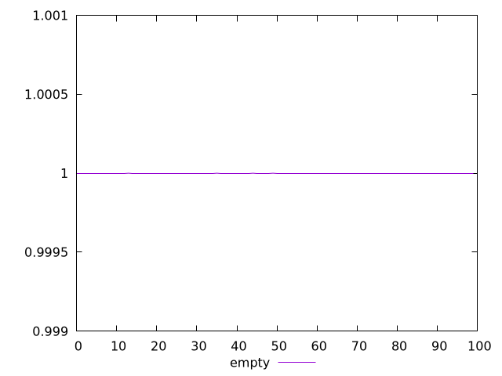
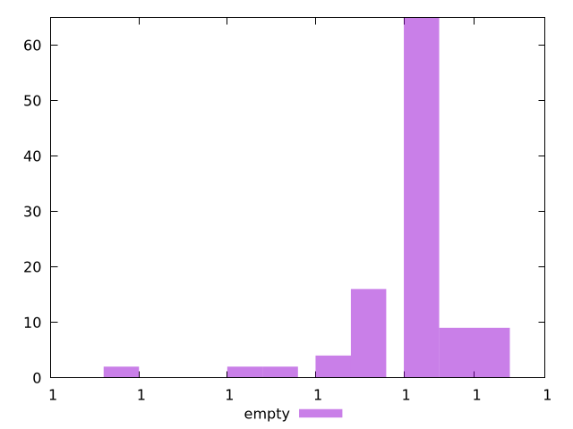
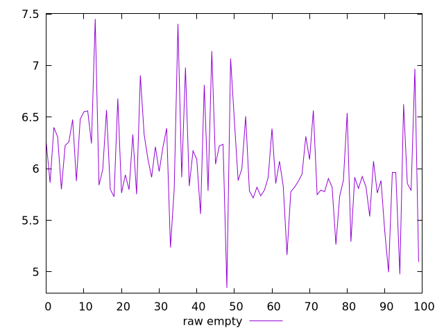
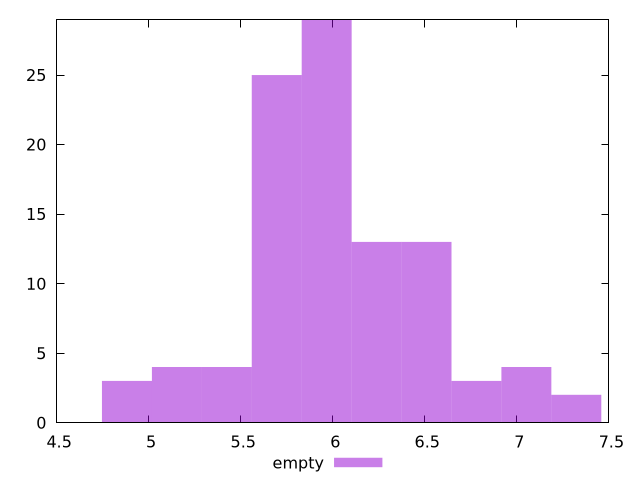

# Report empty

[parent..](./..)  


## Scores

  

## Score Histogram

  

## Score Indicators

```yaml
min: 0.9999999999999979
max: 1
range: 2.1094237467877974e-15
mean: 0.9999999999999999
median: 0.9999999999999998
stdev: 4.176268858247851e-16
skewness: -3.0422342829153433

```

## Raw Values

  

## Raw Values Histogram

  

## Raw Indicators

```yaml
min: 4.844000000000001
max: 7.452000000000001
range: 2.6079999999999997
mean: 6.035160000000001
median: 5.916000000000001
stdev: 0.48213933089927424
skewness: 0.411872116856753

```

<style>
  img {
    max-width: 80%;
  }
</style>
      
