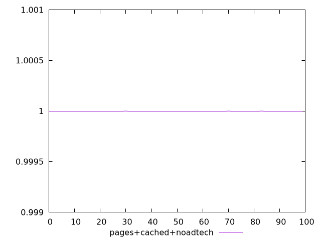
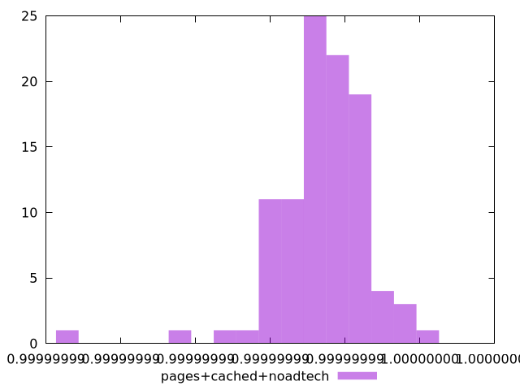
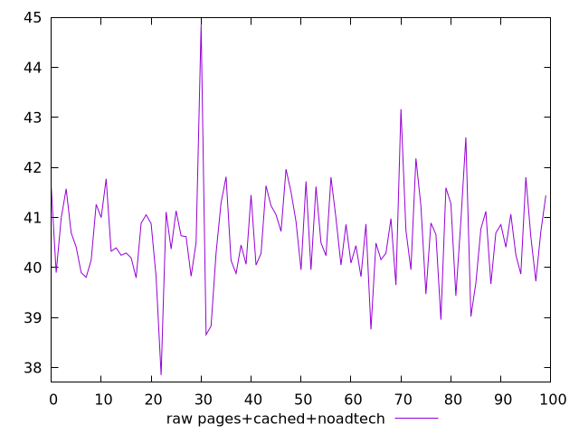
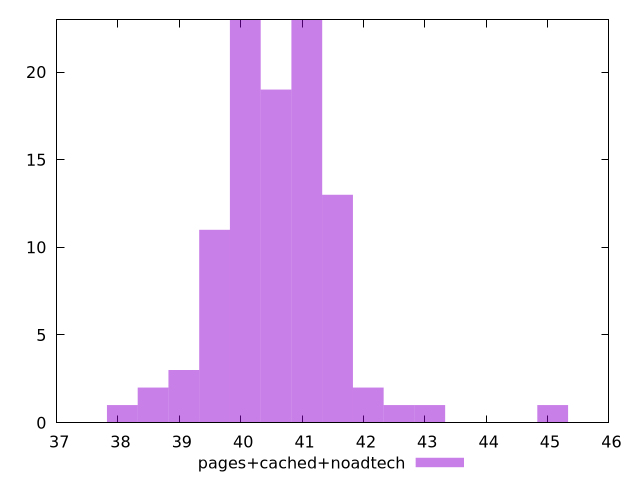

# Report pages+cached+noadtech

[parent..](./..)  


## Scores

  

## Score Histogram

  

## Score Indicators

```yaml
min: 0.9999999864588494
max: 0.9999999961731936
range: 9.714344217925941e-9
mean: 0.9999999934021548
median: 0.9999999934903822
stdev: 1.2374770912594187e-9
skewness: -1.9048530346453152

```

## Raw Values

  

## Raw Values Histogram

  

## Raw Indicators

```yaml
min: 37.848
max: 44.85199999999999
range: 7.003999999999991
mean: 40.61956
median: 40.617999999999995
stdev: 0.95284700052002
skewness: 0.696081286541597

```

<style>
  img {
    max-width: 80%;
  }
</style>
      
