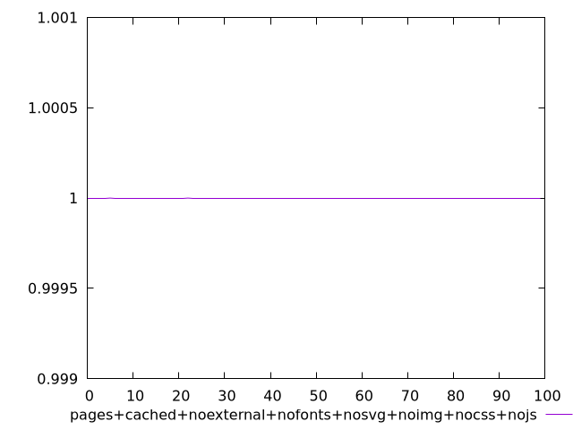
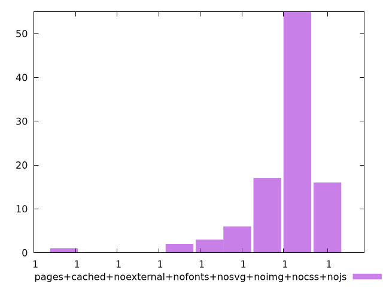
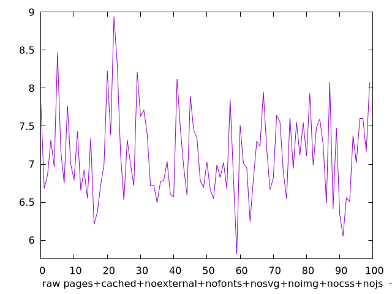
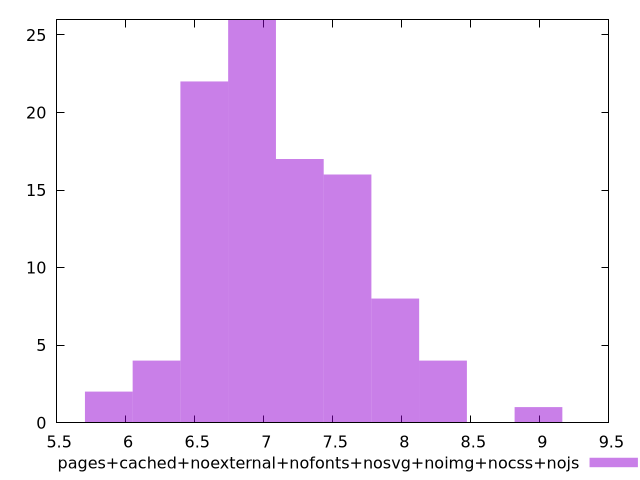

# Report pages+cached+noexternal+nofonts+nosvg+noimg+nocss+nojs

[parent..](./..)  


## Scores

  

## Score Histogram

  

## Score Indicators

```yaml
min: 0.9999999999999869
max: 0.9999999999999998
range: 1.2878587085651816e-14
mean: 0.999999999999999
median: 0.9999999999999989
stdev: 1.9881673553148066e-15
skewness: -3.4900650092017056

```

## Raw Values

  

## Raw Values Histogram

  

## Raw Indicators

```yaml
min: 5.816000000000001
max: 8.94
range: 3.1239999999999988
mean: 7.127040000000003
median: 7.0120000000000005
stdev: 0.5637608343969986
skewness: 0.5339997474341234

```

<style>
  img {
    max-width: 80%;
  }
</style>
      
