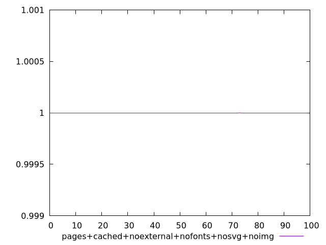
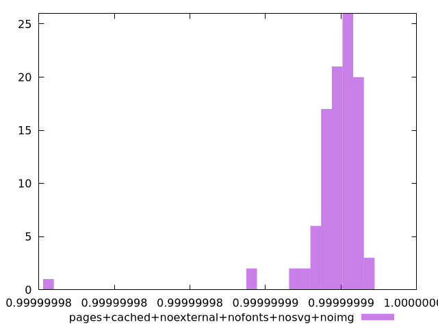
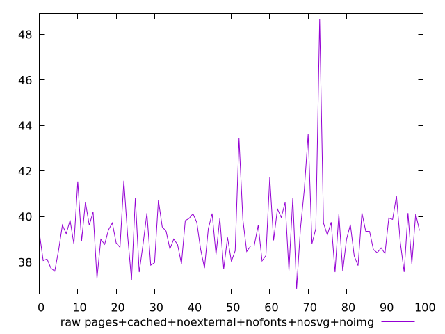
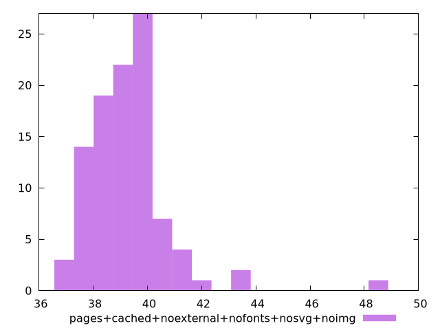

# Report pages+cached+noexternal+nofonts+nosvg+noimg

[parent..](./..)  


## Scores

  

## Score Histogram

  

## Score Indicators

```yaml
min: 0.9999999754924316
max: 0.9999999968854432
range: 2.1393011584436294e-8
mean: 0.9999999946799969
median: 0.9999999950312332
stdev: 2.3291062991666045e-9
skewness: -5.834430142688571

```

## Raw Values

  

## Raw Values Histogram

  

## Raw Indicators

```yaml
min: 36.83599999999999
max: 48.67999999999998
range: 11.843999999999987
mean: 39.313959999999994
median: 39.17999999999999
stdev: 1.5313358868647984
skewness: 2.6014163421210634

```

<style>
  img {
    max-width: 80%;
  }
</style>
      
