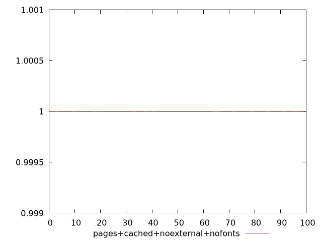
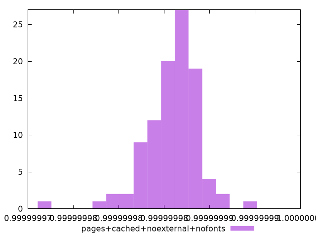
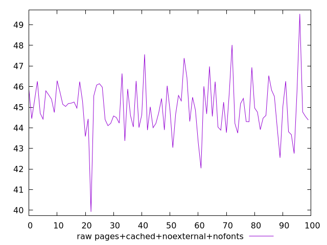
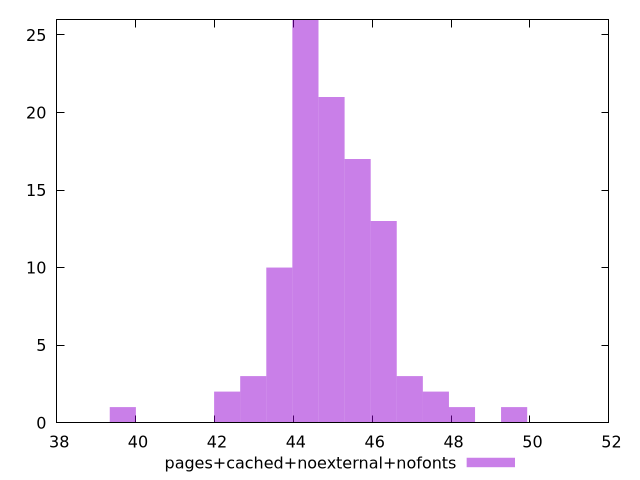

# Report pages+cached+noexternal+nofonts

[parent..](./..)  


## Scores

  

## Score Histogram

  

## Score Indicators

```yaml
min: 0.9999999722642081
max: 0.9999999942775851
range: 2.201337701013273e-8
mean: 0.9999999859572981
median: 0.9999999864544209
stdev: 2.9351847402824745e-9
skewness: -1.1295115913029077

```

## Raw Values

  

## Raw Values Histogram

  

## Raw Indicators

```yaml
min: 39.92399999999998
max: 49.52799999999999
range: 9.604000000000013
mean: 44.96784
median: 44.85399999999999
stdev: 1.2655910138745452
skewness: -0.05791609091925912

```

<style>
  img {
    max-width: 80%;
  }
</style>
      
