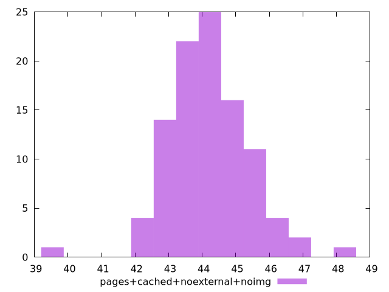

# Report pages+cached+noexternal+noimg

[parent..](./..)  


## Scores

  

## Score Histogram

  

## Score Indicators

```yaml
min: 0.9999999765848036
max: 0.9999999944681768
range: 1.788337322672362e-8
mean: 0.9999999875520885
median: 0.999999987895629
stdev: 2.511842239345221e-9
skewness: -1.034655178600232

```

## Raw Values

  

## Raw Values Histogram

  

## Raw Indicators

```yaml
min: 39.74399999999999
max: 48.372
range: 8.628000000000007
mean: 44.2408
median: 44.169999999999995
stdev: 1.1900226552465287
skewness: 0.11420719830727163

```

<style>
  img {
    max-width: 80%;
  }
</style>
      
