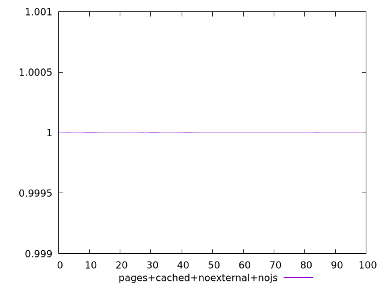
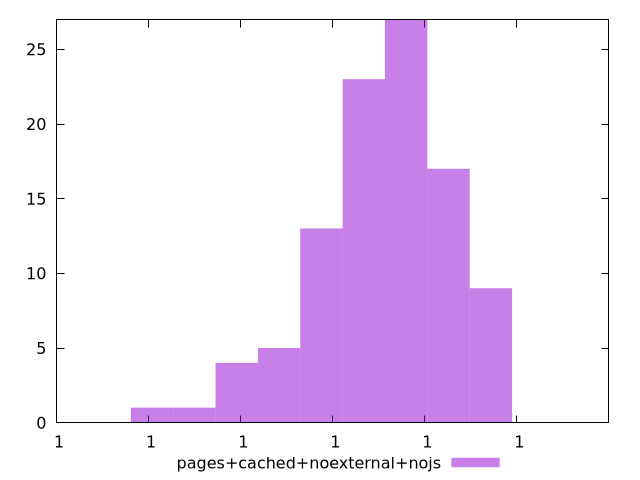
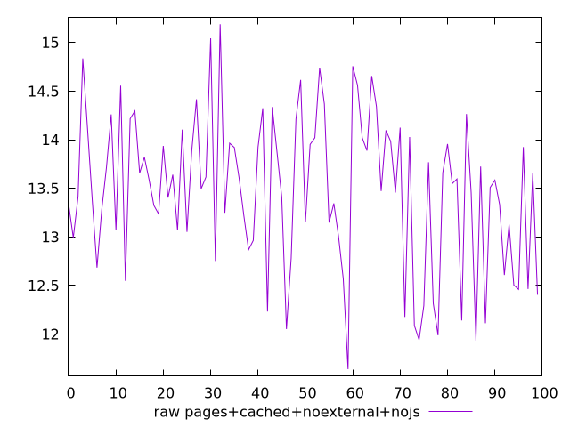
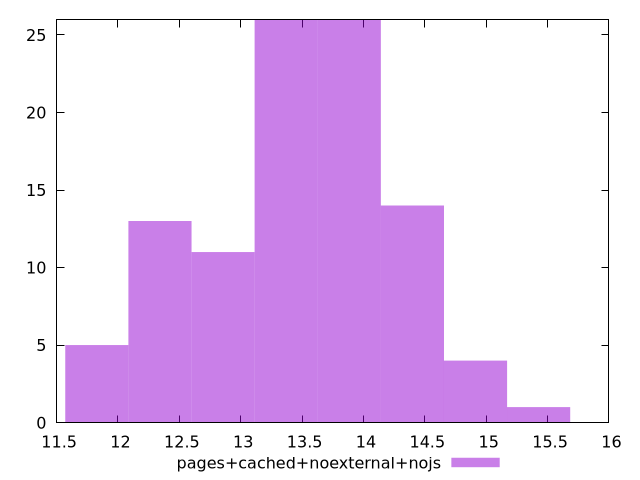

# Report pages+cached+noexternal+nojs

[parent..](./..)  


## Scores

  

## Score Histogram

  

## Score Indicators

```yaml
min: 0.9999999999980482
max: 0.999999999999833
range: 1.7847945343874017e-12
mean: 0.9999999999992637
median: 0.9999999999993032
stdev: 3.708001655780867e-13
skewness: -0.7667893986125407

```

## Raw Values

  

## Raw Values Histogram

  

## Raw Indicators

```yaml
min: 11.64
max: 15.188000000000002
range: 3.548000000000002
mean: 13.473159999999998
median: 13.566
stdev: 0.7878814723040514
skewness: -0.2680699134273648

```

<style>
  img {
    max-width: 80%;
  }
</style>
      
