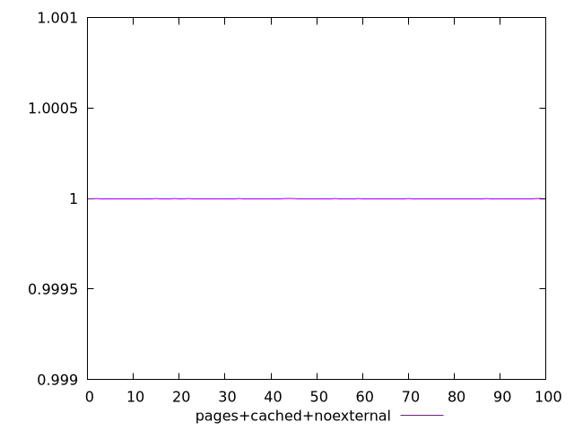
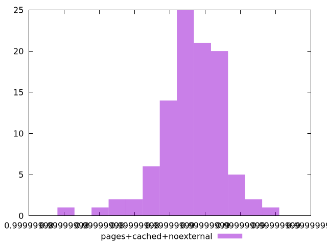
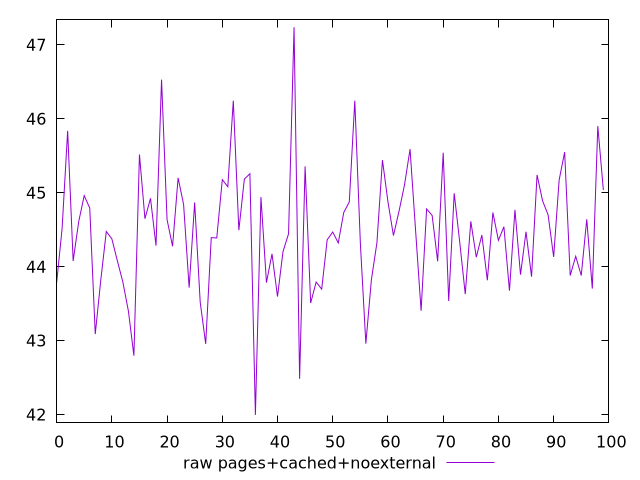
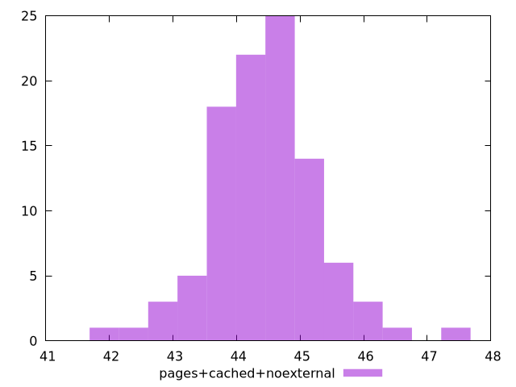

# Report pages+cached+noexternal

[parent..](./..)  


## Scores

  

## Score Histogram

  

## Score Indicators

```yaml
min: 0.9999999802708532
max: 0.9999999916566511
range: 1.13857978600862e-8
mean: 0.9999999872022991
median: 0.999999987309413
stdev: 1.7794742963678177e-9
skewness: -0.7281498451562376

```

## Raw Values

  

## Raw Values Histogram

  

## Raw Indicators

```yaml
min: 41.99599999999999
max: 47.23599999999999
range: 5.240000000000002
mean: 44.45936
median: 44.45599999999999
stdev: 0.8317362505025256
skewness: 0.18678784839267126

```

<style>
  img {
    max-width: 80%;
  }
</style>
      
