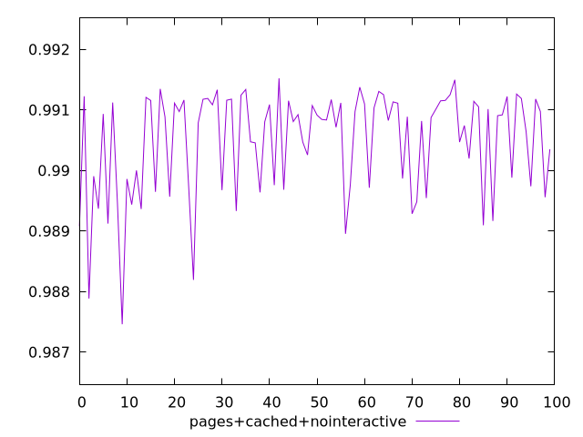
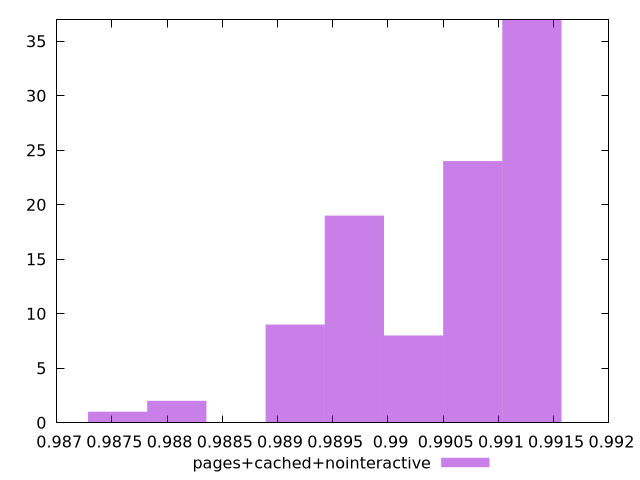
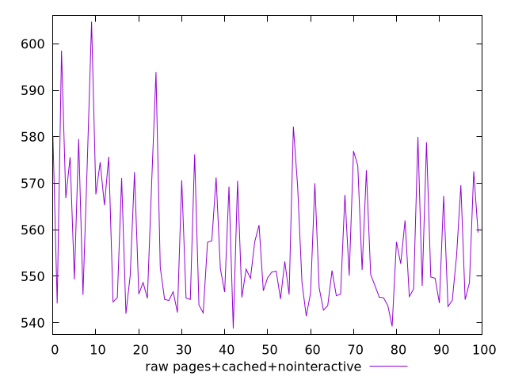
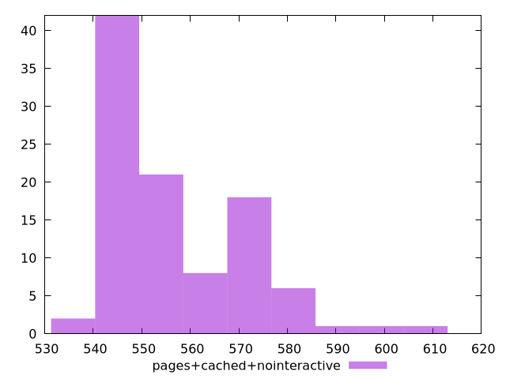

# Report pages+cached+nointeractive

[parent..](./..)  


## Scores

  

## Score Histogram

  

## Score Indicators

```yaml
min: 0.9874616336868934
max: 0.991522837869242
range: 0.004061204182348566
mean: 0.9904850482617574
median: 0.9908810417108957
stdev: 0.0008536220010869028
skewness: -1.1525025655022454

```

## Raw Values

  

## Raw Values Histogram

  

## Raw Indicators

```yaml
min: 538.7760000000001
max: 604.7880000000004
range: 66.01200000000028
mean: 556.7704000000006
median: 550.2740000000003
stdev: 14.236200672932366
skewness: 1.0481931707919814

```

<style>
  img {
    max-width: 80%;
  }
</style>
      
