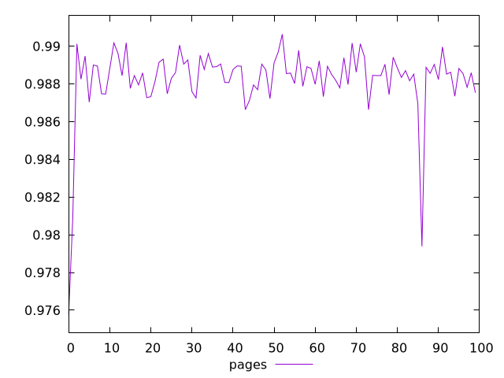
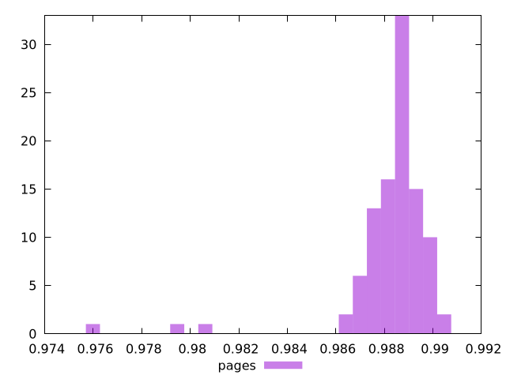
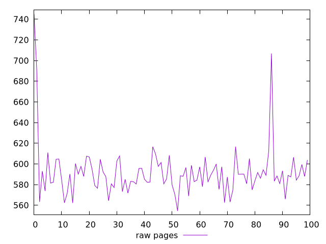
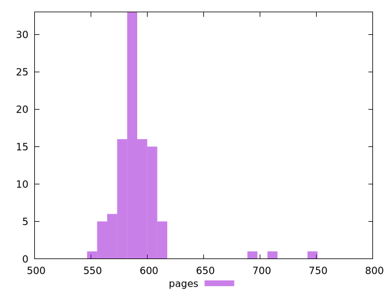

# Report pages

[parent..](./..)  


## Scores

  

## Score Histogram

  

## Score Indicators

```yaml
min: 0.9758012137608907
max: 0.9906345293294312
range: 0.014833315568540506
mean: 0.9882599343360684
median: 0.9885683106423321
stdev: 0.0019209500128917552
skewness: -4.188208229246452

```

## Raw Values

  

## Raw Values Histogram

  

## Raw Indicators

```yaml
min: 554.5640000000004
max: 745.1760000000008
range: 190.61200000000042
mean: 591.8783200000003
median: 588.1980000000003
stdev: 25.465690174381734
skewness: 3.537431336378623

```

<style>
  img {
    max-width: 80%;
  }
</style>
      
