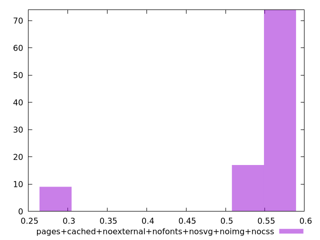

# Report pages+cached+noexternal+nofonts+nosvg+noimg+nocss

[parent..](./..)  


## Scores

  

## Score Histogram

  

## Score Indicators

```yaml
min: 0.2963432211283839
max: 0.5499689372766312
range: 0.2536257161482473
mean: 0.526804957843013
median: 0.5499689372766312
stdev: 0.07248062568056719
skewness: -2.864769535426987

```

## Raw Values

  

## Raw Values Histogram

  

## Raw Indicators

```yaml
min: 0.22853081597222222
max: 0.3664786512586805
range: 0.1379478352864583
mean: 0.24108572184244775
median: 0.22853081597222222
stdev: 0.039435433931749475
skewness: 2.8649984842636296

```

<style>
  img {
    max-width: 80%;
  }
</style>
      
