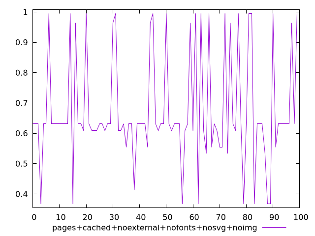
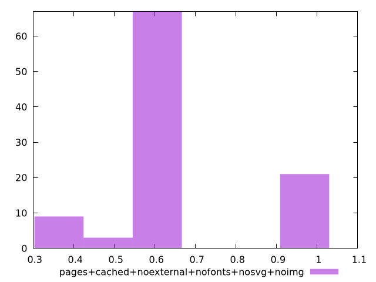
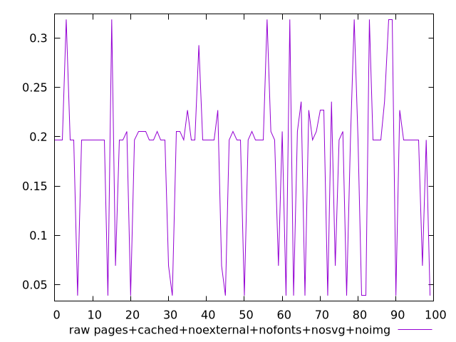
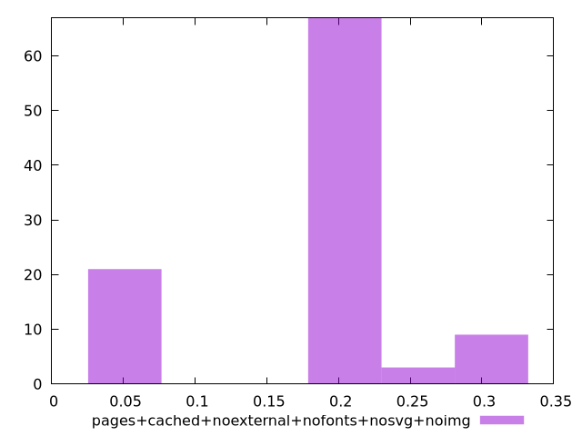

# Report pages+cached+noexternal+nofonts+nosvg+noimg

[parent..](./..)  


## Scores

  

## Score Histogram

  

## Score Indicators

```yaml
min: 0.36692102630185863
max: 0.9953476174851198
range: 0.6284265911832612
mean: 0.6718162656167128
median: 0.6313938914065288
stdev: 0.17794063095699583
skewness: 0.6902928282652988

```

## Raw Values

  

## Raw Values Histogram

  

## Raw Indicators

```yaml
min: 0.0389404296875
max: 0.3188018798828125
range: 0.2798614501953125
mean: 0.1802727494557699
median: 0.19667434692382812
stdev: 0.07638429559185694
skewness: -0.5913838503857594

```

<style>
  img {
    max-width: 80%;
  }
</style>
      
