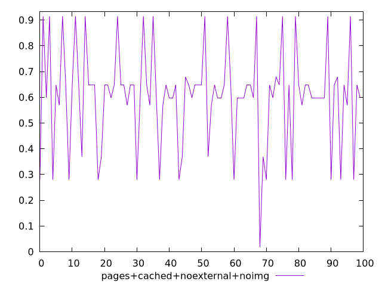
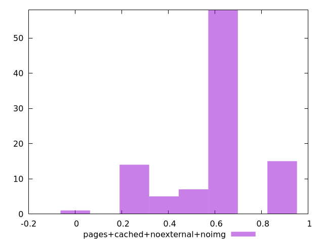
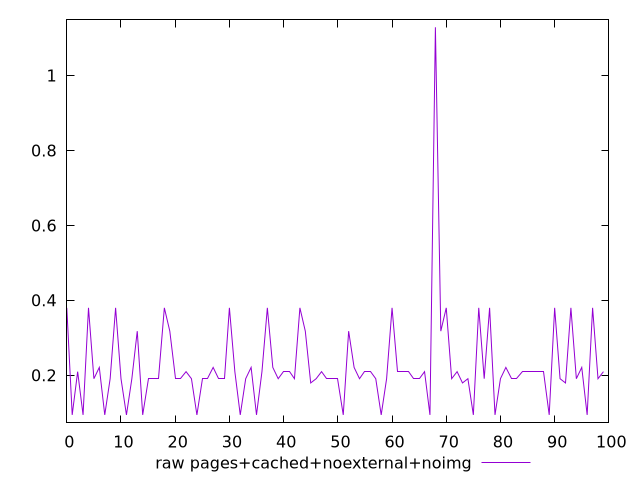
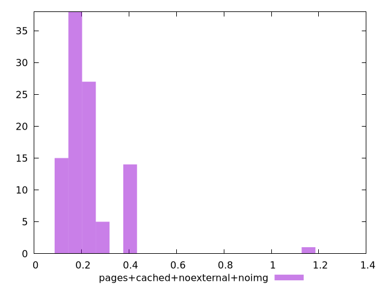

# Report pages+cached+noexternal+noimg

[parent..](./..)  


## Scores

  

## Score Histogram

  

## Score Indicators

```yaml
min: 0.017481246450500643
max: 0.9146517814122077
range: 0.8971705349617071
mean: 0.6014679325398284
median: 0.6478936866255779
stdev: 0.19069691310678996
skewness: -0.38149671616684094

```

## Raw Values

  

## Raw Values Histogram

  

## Raw Indicators

```yaml
min: 0.0938739013671875
max: 1.1291448974609375
range: 1.03527099609375
mean: 0.22383357486724853
median: 0.1905707836151123
stdev: 0.12273055789776799
skewness: 4.1363317405599105

```

<style>
  img {
    max-width: 80%;
  }
</style>
      
