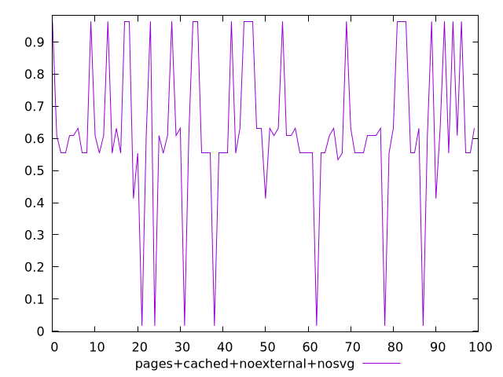
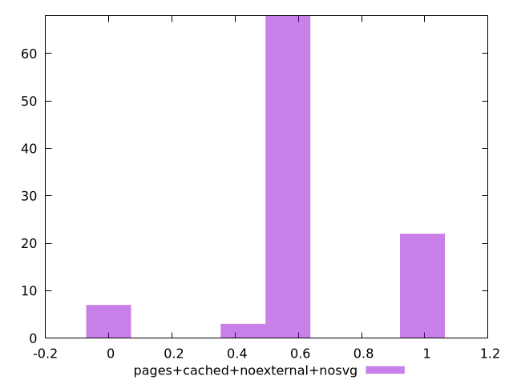
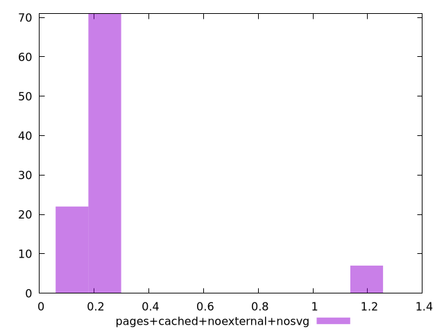

# Report pages+cached+noexternal+nosvg

[parent..](./..)  


## Scores

  

## Score Histogram

  

## Score Indicators

```yaml
min: 0.01659363310226647
max: 0.9638914552234408
range: 0.9472978221211743
mean: 0.6248702206517164
median: 0.6085969600017687
stdev: 0.23298883950524024
skewness: -0.6001691790248802

```

## Raw Values

  

## Raw Values Histogram

  

## Raw Indicators

```yaml
min: 0.0691375732421875
max: 1.1462412516276042
range: 1.0771036783854167
mean: 0.24965212898254394
median: 0.20527796427408854
stdev: 0.25394227598517377
skewness: 2.9992938642933042

```

<style>
  img {
    max-width: 80%;
  }
</style>
      
