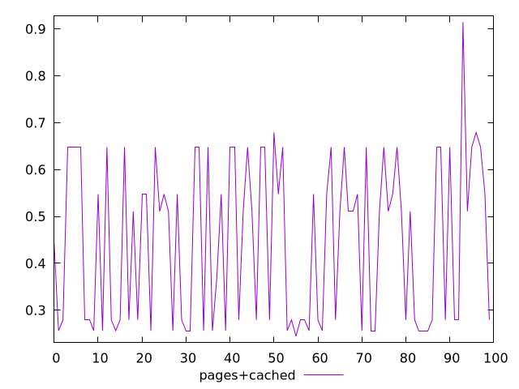
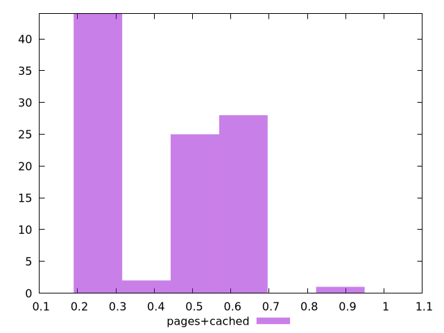
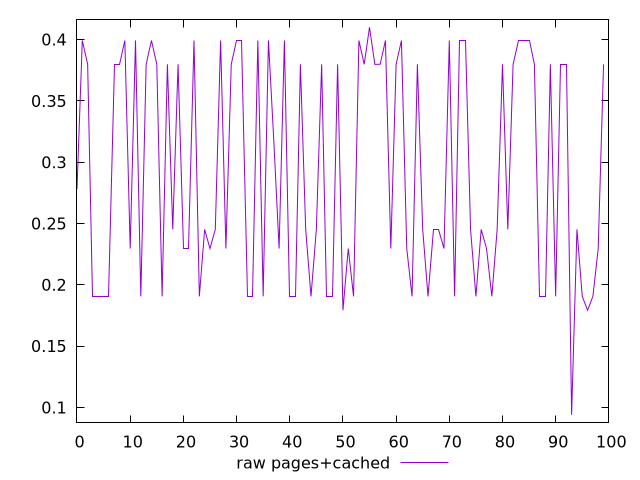
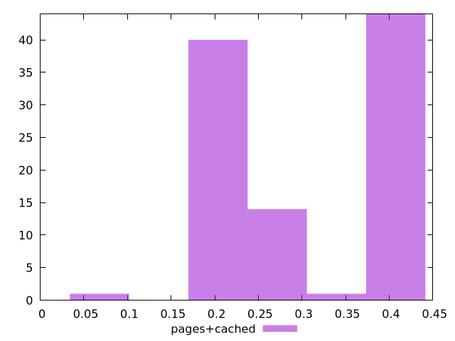

# Report pages+cached

[parent..](./..)  


## Scores

  

## Score Histogram

  

## Score Indicators

```yaml
min: 0.24444197763032915
max: 0.9145821263333085
range: 0.6701401487029793
mean: 0.4492966066631856
median: 0.5108242979213455
stdev: 0.17233588846223352
skewness: 0.15014553562661542

```

## Raw Values

  

## Raw Values Histogram

  

## Raw Indicators

```yaml
min: 0.09390384928385416
max: 0.41005506981743695
range: 0.3161512205335828
mean: 0.29077628013822776
median: 0.24519634310404465
stdev: 0.09107400280939194
skewness: 0.03938507807762704

```

<style>
  img {
    max-width: 80%;
  }
</style>
      
