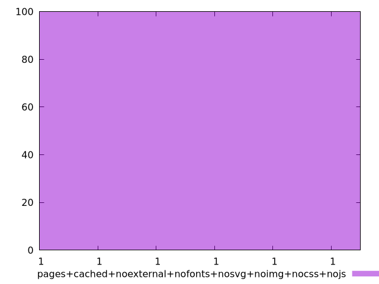
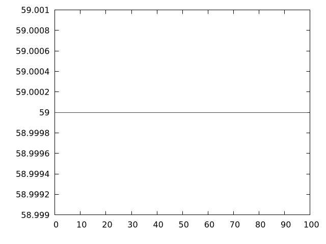
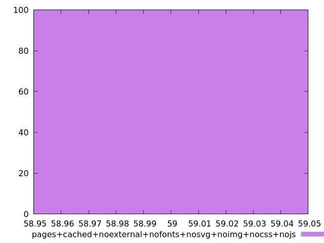

# Report pages+cached+noexternal+nofonts+nosvg+noimg+nocss+nojs

[parent..](./..)  


## Scores

  

## Score Histogram

  

## Score Indicators

```yaml
min: 0.9999999999999785
max: 0.9999999999999785
range: 0
mean: 0.9999999999999761
median: 0.9999999999999785
stdev: 2.3314683517128287e-15
skewness: 1

```

## Raw Values

  

## Raw Values Histogram

  

## Raw Indicators

```yaml
min: 59
max: 59
range: 0
mean: 59
median: 59
stdev: 0
skewness: .nan

```

<style>
  img {
    max-width: 80%;
  }
</style>
      
