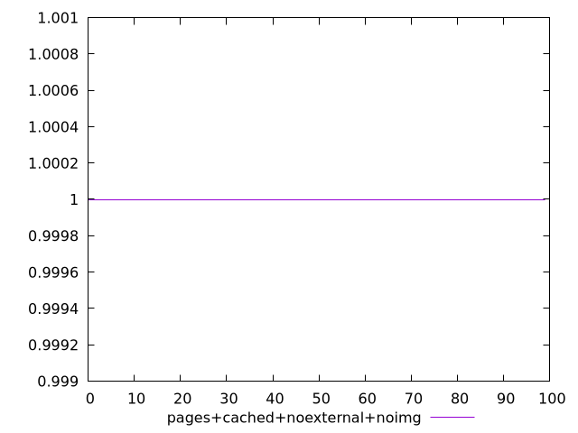
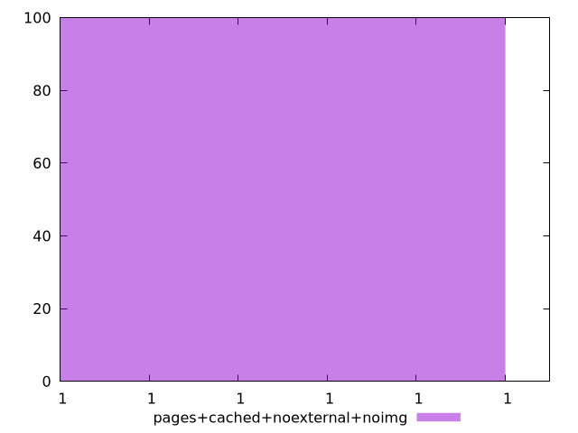
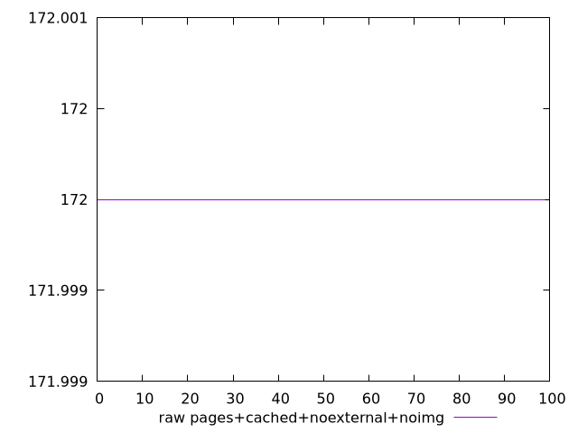
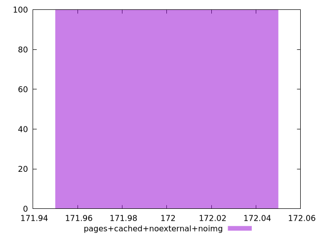

# Report pages+cached+noexternal+noimg

[parent..](./..)  


## Scores

  

## Score Histogram

  

## Score Indicators

```yaml
min: 0.9999997135746177
max: 0.9999997135746177
range: 0
mean: 0.9999997135746196
median: 0.9999997135746177
stdev: 1.887379141862766e-15
skewness: -1

```

## Raw Values

  

## Raw Values Histogram

  

## Raw Indicators

```yaml
min: 172
max: 172
range: 0
mean: 172
median: 172
stdev: 0
skewness: .nan

```

<style>
  img {
    max-width: 80%;
  }
</style>
      
