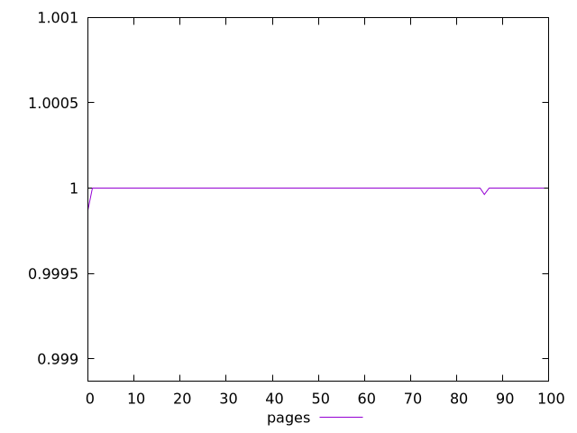
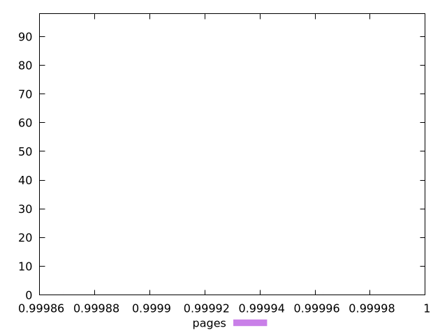
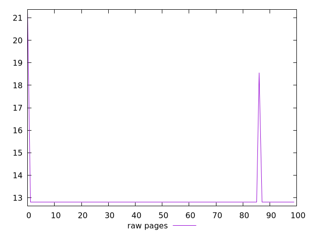
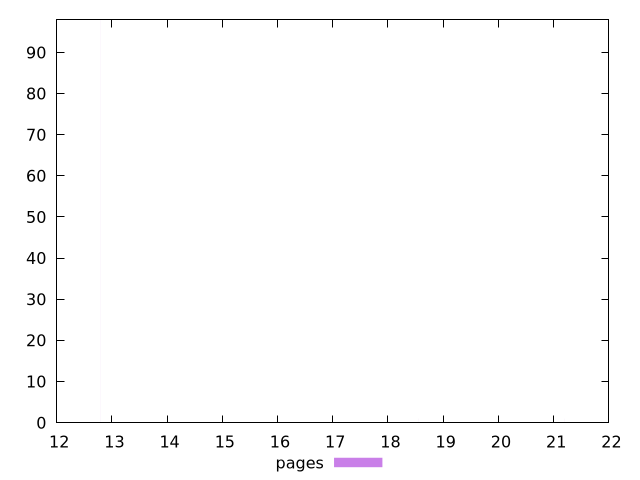

# Report pages

[parent..](./..)  


## Scores

  

## Score Histogram

  

## Score Indicators

```yaml
min: 0.999868516676541
max: 0.9999993380488856
range: 0.0001308213723446583
mean: 0.9999976650417769
median: 0.9999993380488856
stdev: 0.000013477788511772172
skewness: -8.968903930621172

```

## Raw Values

  

## Raw Values Histogram

  

## Raw Indicators

```yaml
min: 12.8
max: 21.200000000000003
range: 8.400000000000002
mean: 12.941599999999976
median: 12.8
stdev: 1.008625520200635
skewness: 7.214762556973234

```

<style>
  img {
    max-width: 80%;
  }
</style>
      
