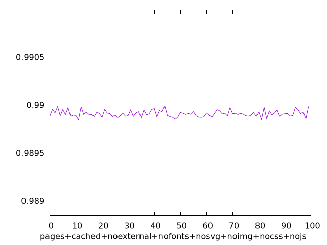

# Report pages+cached+noexternal+nofonts+nosvg+noimg+nocss+nojs

[parent..](./..)  


## Scores

  

## Score Histogram

  

## Score Indicators

```yaml
min: 0.9898424762111055
max: 0.9899895664509943
range: 0.00014709023988879188
mean: 0.9899071407480798
median: 0.9899030250955094
stdev: 0.00003338587271047386
skewness: 0.5579954387349979

```

## Raw Values

  

## Raw Values Histogram

  

## Raw Indicators

```yaml
min: 1506.9898
max: 1510.459
range: 3.4692000000000007
mean: 1508.9373759999999
median: 1509.0353
stdev: 0.7874440329471022
skewness: -0.5632224666911744

```

<style>
  img {
    max-width: 80%;
  }
</style>
      
