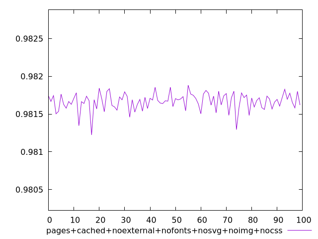
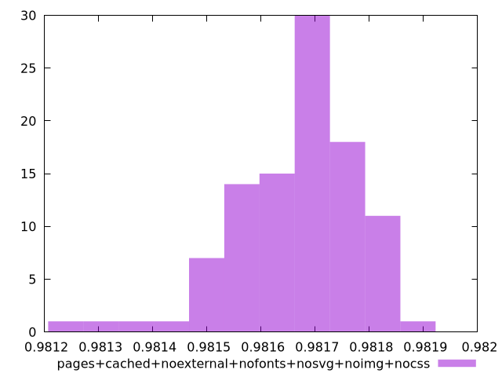
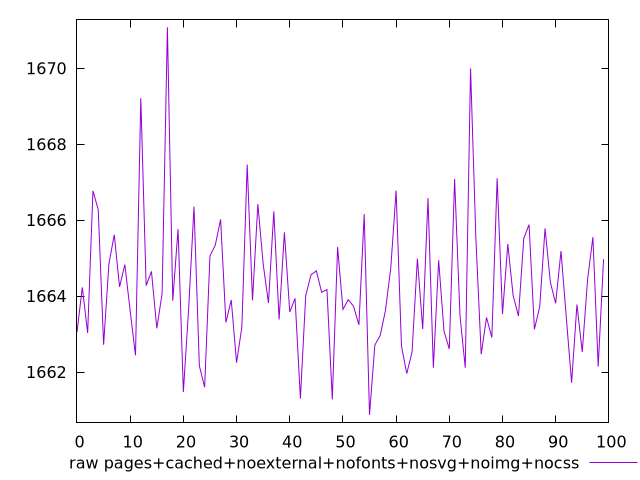
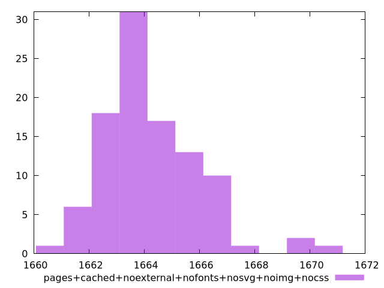

# Report pages+cached+noexternal+nofonts+nosvg+noimg+nocss

[parent..](./..)  


## Scores

  

## Score Histogram

  

## Score Indicators

```yaml
min: 0.9812232259159619
max: 0.9818828196992779
range: 0.000659593783316037
mean: 0.9816665926976246
median: 0.9816887123682376
stdev: 0.00011516774923115603
skewness: -1.0315458140507363

```

## Raw Values

  

## Raw Values Histogram

  

## Raw Indicators

```yaml
min: 1660.8732000000005
max: 1671.0765000000001
range: 10.203299999999672
mean: 1664.24167
median: 1663.90175
stdev: 1.7850620844945302
skewness: 1.012918711907463

```

<style>
  img {
    max-width: 80%;
  }
</style>
      
