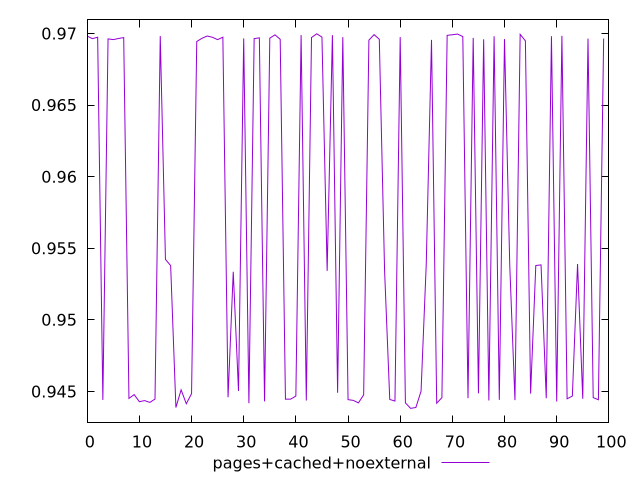
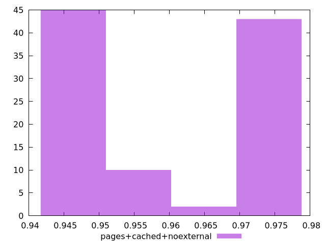

# Report pages+cached+noexternal

[parent..](./..)  


## Scores

  

## Score Histogram

  

## Score Indicators

```yaml
min: 0.943818659790264
max: 0.9699760042600412
range: 0.026157344469777133
mean: 0.9567610112751364
median: 0.9538017246903837
stdev: 0.01202448697232026
skewness: 0.08061909075940549

```

## Raw Values

  

## Raw Values Histogram

  

## Raw Indicators

```yaml
min: 1816.8288000000002
max: 2054.36825
range: 237.53944999999976
mean: 1938.5034780000008
median: 1973.8833
stdev: 109.65505452247588
skewness: -0.10375359337351027

```

<style>
  img {
    max-width: 80%;
  }
</style>
      
