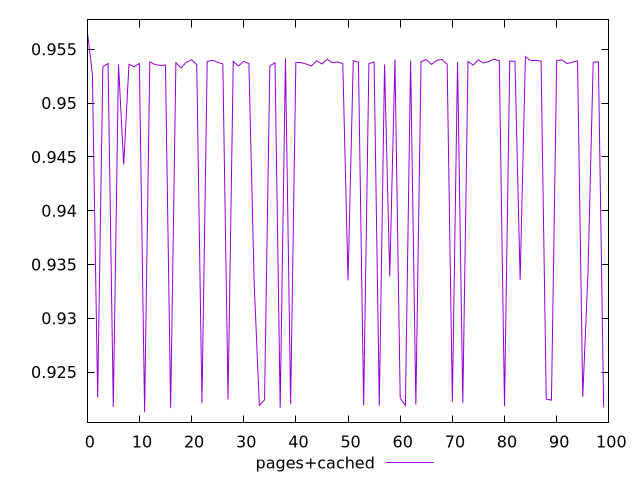
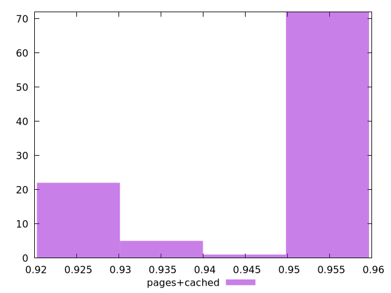
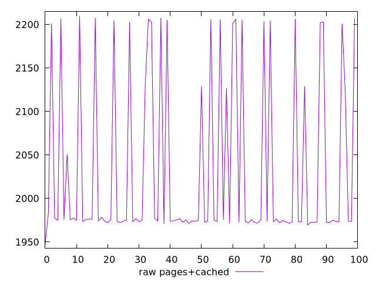
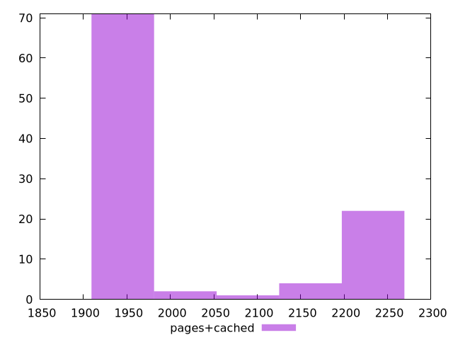

# Report pages+cached

[parent..](./..)  


## Scores

  

## Score Histogram

  

## Score Indicators

```yaml
min: 0.9212994102952925
max: 0.9567701181098782
range: 0.03547070781458572
mean: 0.9457300793155803
median: 0.953675948169843
stdev: 0.013323654906647948
skewness: -1.1063854351177687

```

## Raw Values

  

## Raw Values Histogram

  

## Raw Indicators

```yaml
min: 1947.971
max: 2209.8149500000004
range: 261.8439500000004
mean: 2033.0961759999998
median: 1974.9586999999997
stdev: 97.40651979095408
skewness: 1.0889504093675597

```

<style>
  img {
    max-width: 80%;
  }
</style>
      
