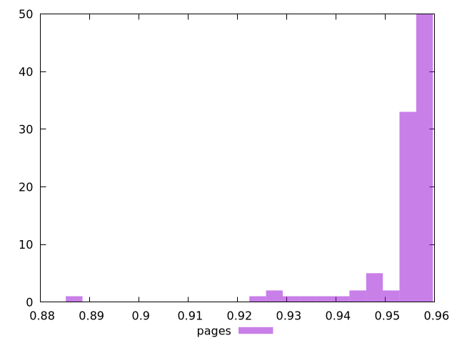

# Report pages

[parent..](./..)  


## Scores

  

## Score Histogram

  

## Score Indicators

```yaml
min: 0.8868314748722668
max: 0.957102437565996
range: 0.07027096269372923
mean: 0.953114924330595
median: 0.9562224824038881
stdev: 0.009566139925005933
skewness: -4.3064560856595975

```

## Raw Values

  

## Raw Values Histogram

  

## Raw Indicators

```yaml
min: 1945.0035000000003
max: 2407.3655
range: 462.3619999999996
mean: 1976.2337549999997
median: 1952.831
stdev: 68.37123918971686
skewness: 3.6931695412664296

```

<style>
  img {
    max-width: 80%;
  }
</style>
      
