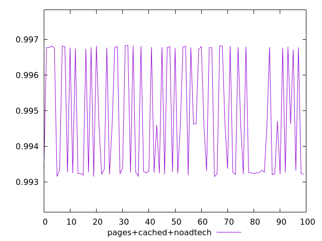
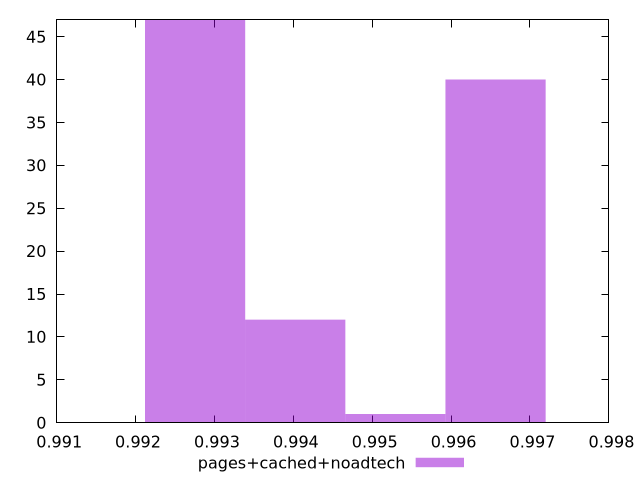
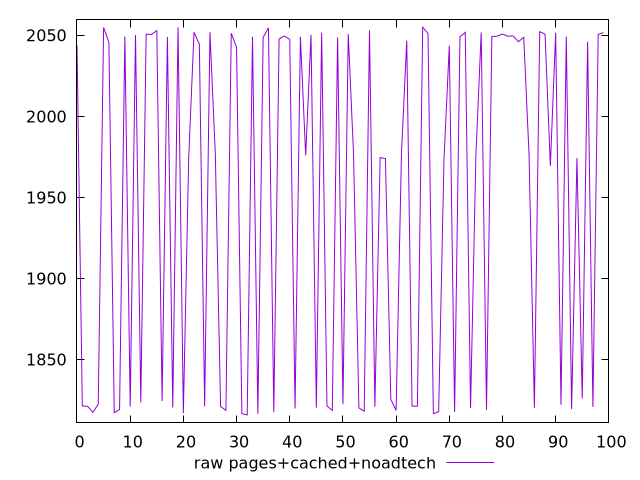
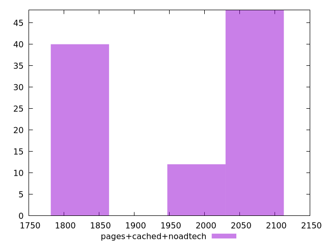

# Report pages+cached+noadtech

[parent..](./..)  


## Scores

  

## Score Histogram

  

## Score Indicators

```yaml
min: 0.9931492519276602
max: 0.9968317041437396
range: 0.003682452216079324
mean: 0.9948286040804226
median: 0.994584367002109
stdev: 0.0016524122117152114
skewness: 0.24499476969998157

```

## Raw Values

  

## Raw Values Histogram

  

## Raw Indicators

```yaml
min: 1815.857
max: 2055.00835
range: 239.1513500000001
mean: 1948.8976089999994
median: 1976.7597
stdev: 107.80329128230348
skewness: -0.28813901632440425

```

<style>
  img {
    max-width: 80%;
  }
</style>
      
