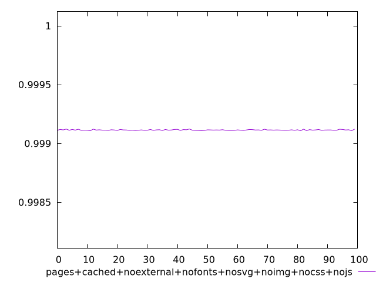
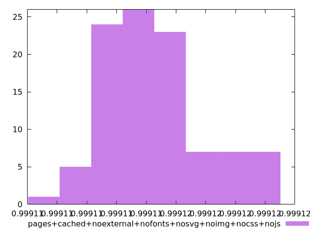

# Report pages+cached+noexternal+nofonts+nosvg+noimg+nocss+nojs

[parent..](./..)  


## Scores

  

## Score Histogram

  

## Score Indicators

```yaml
min: 0.9991079629833008
max: 0.9991227705354161
range: 0.00001480755211524798
mean: 0.9991144765889511
median: 0.9991140631978572
stdev: 0.0000033609259770478938
skewness: 0.5566618216256468

```

## Raw Values

  

## Raw Values Histogram

  

## Raw Indicators

```yaml
min: 1506.9898
max: 1510.459
range: 3.4692000000000007
mean: 1508.9373759999999
median: 1509.0353
stdev: 0.7874440329471022
skewness: -0.5632224666911744

```

<style>
  img {
    max-width: 80%;
  }
</style>
      
