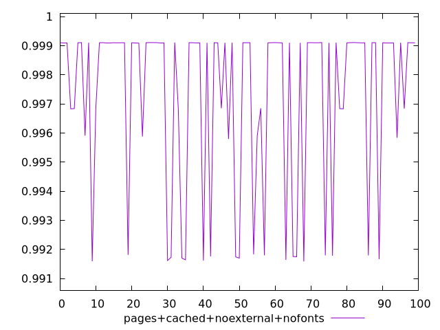
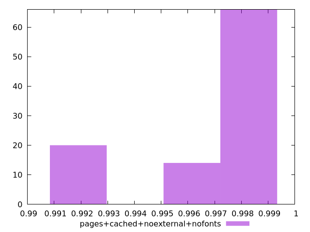
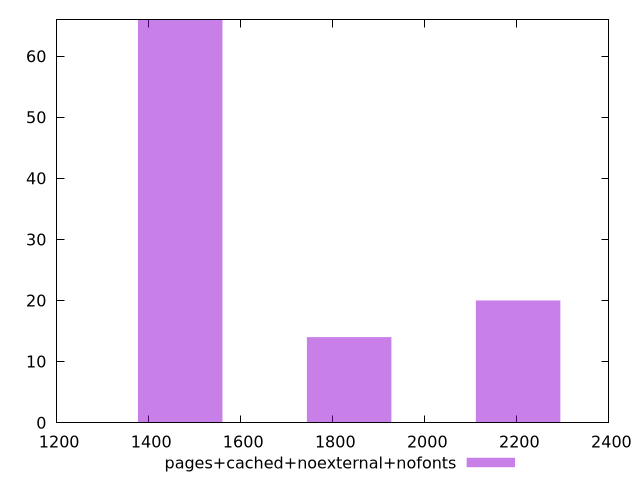

# Report pages+cached+noexternal+nofonts

[parent..](./..)  


## Scores

  

## Score Histogram

  

## Score Indicators

```yaml
min: 0.9915853859990458
max: 0.9991080935823182
range: 0.007522707583272448
mean: 0.9972576107969013
median: 0.9990980061937385
stdev: 0.002915526053835627
skewness: -1.2141528223443718

```

## Raw Values

  

## Raw Values Histogram

  

## Raw Indicators

```yaml
min: 1510.4286000000002
max: 2127.8655
range: 617.4368999999997
mean: 1680.5527344999991
median: 1512.7665
stdev: 248.21882781082724
skewness: 0.9668443775703501

```

<style>
  img {
    max-width: 80%;
  }
</style>
      
