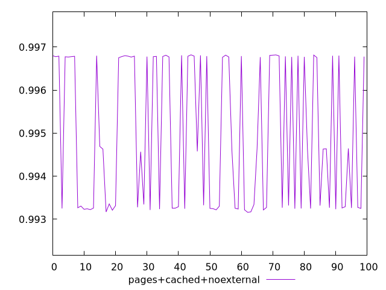
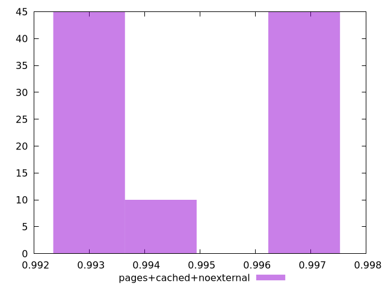

# Report pages+cached+noexternal

[parent..](./..)  


## Scores

  

## Score Histogram

  

## Score Indicators

```yaml
min: 0.9931619917360298
max: 0.9968206806750979
range: 0.0036586889390680666
mean: 0.9949844147665041
median: 0.9946325664296678
stdev: 0.0016783251229405898
skewness: 0.06913888492586094

```

## Raw Values

  

## Raw Values Histogram

  

## Raw Indicators

```yaml
min: 1816.8288000000002
max: 2054.36825
range: 237.53944999999976
mean: 1938.5034780000008
median: 1973.8833
stdev: 109.65505452247588
skewness: -0.10375359337351027

```

<style>
  img {
    max-width: 80%;
  }
</style>
      
