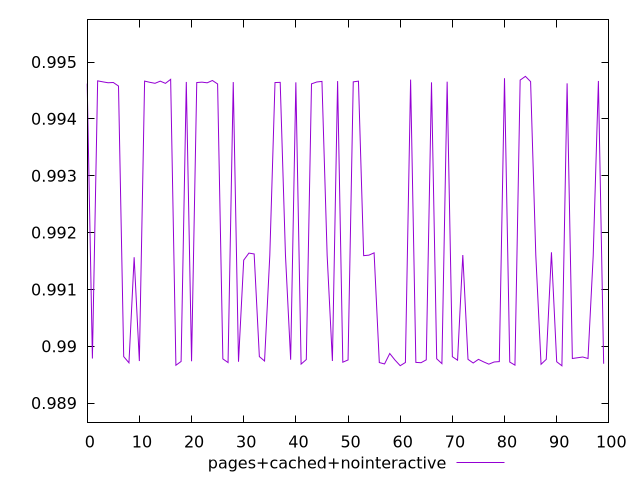
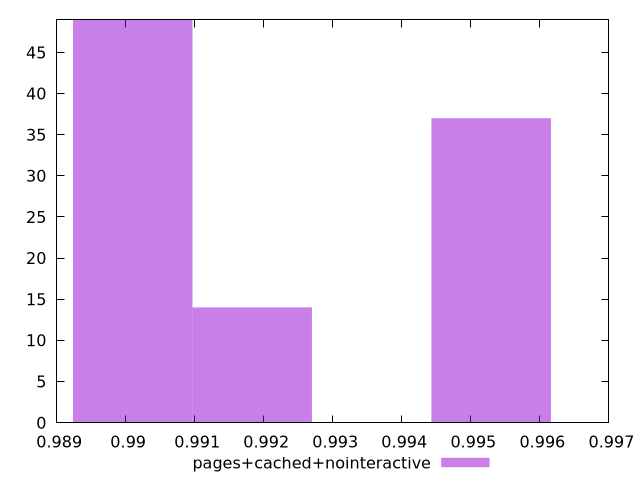
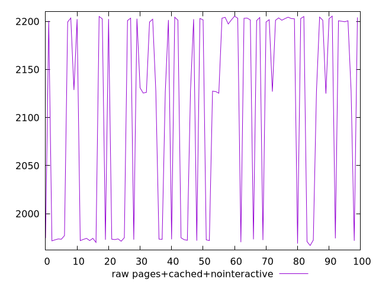
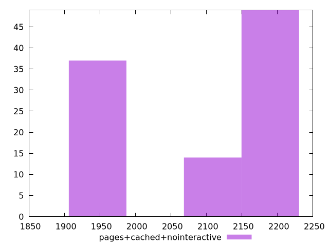

# Report pages+cached+nointeractive

[parent..](./..)  


## Scores

  

## Score Histogram

  

## Score Indicators

```yaml
min: 0.9896559295246983
max: 0.9947478220338701
range: 0.005091892509171858
mean: 0.9918177842013586
median: 0.99154005254557
stdev: 0.0022575205267004166
skewness: 0.3491343313974312

```

## Raw Values

  

## Raw Values Histogram

  

## Raw Indicators

```yaml
min: 1966.9283
max: 2205.583
range: 238.65470000000005
mean: 2106.902251
median: 2129.82715
stdev: 105.79991800052517
skewness: -0.39290271988521747

```

<style>
  img {
    max-width: 80%;
  }
</style>
      
