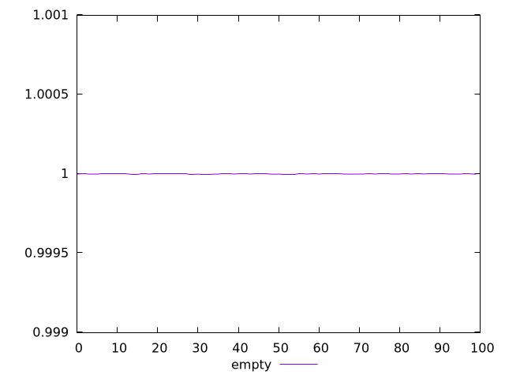
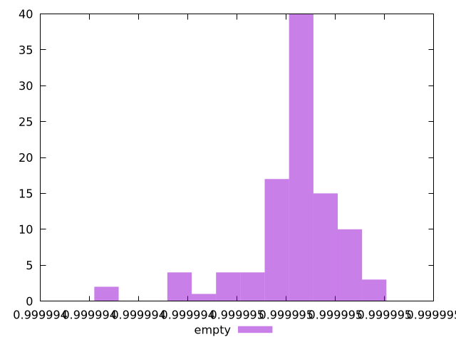
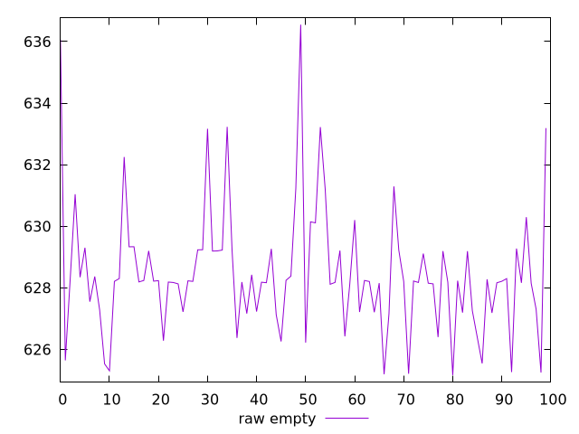
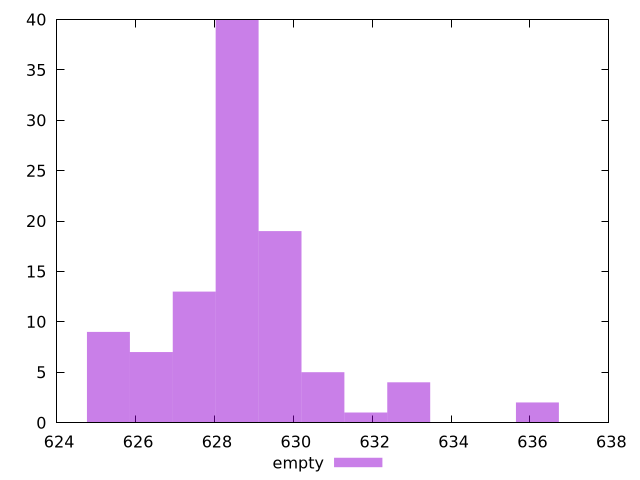

# Report empty

[parent..](./..)  


## Scores

  

## Score Histogram

  

## Score Indicators

```yaml
min: 0.9999940448449472
max: 0.9999951154730691
range: 0.0000010706281218242353
mean: 0.999994820188546
median: 0.9999948468183575
stdev: 1.900967371387981e-7
skewness: -1.5250435897022896

```

## Raw Values

  

## Raw Values Histogram

  

## Raw Indicators

```yaml
min: 625.16225
max: 636.54885
range: 11.386600000000044
mean: 628.470438
median: 628.2082499999999
stdev: 2.0518513899052238
skewness: 1.3653662993665308

```

<style>
  img {
    max-width: 80%;
  }
</style>
      
