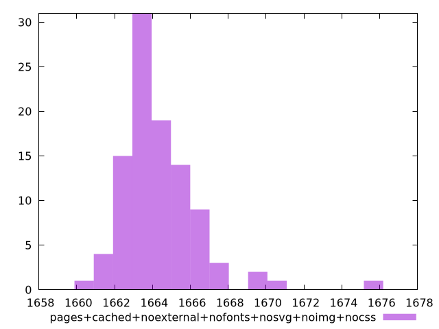

# Report pages+cached+noexternal+nofonts+nosvg+noimg+nocss

[parent..](./..)  


## Scores

  

## Score Histogram

  

## Score Indicators

```yaml
min: 0.9809007034010104
max: 0.9818828196992779
range: 0.0009821162982674991
mean: 0.9816571574647286
median: 0.9816873293194877
stdev: 0.0001368390026096369
skewness: -2.183008403334149

```

## Raw Values

  

## Raw Values Histogram

  

## Raw Indicators

```yaml
min: 1660.8732000000005
max: 1675.9770999999996
range: 15.103899999999157
mean: 1664.38667
median: 1663.92325
stdev: 2.1133377263229476
skewness: 2.1389873707373344

```

<style>
  img {
    max-width: 80%;
  }
</style>
      
