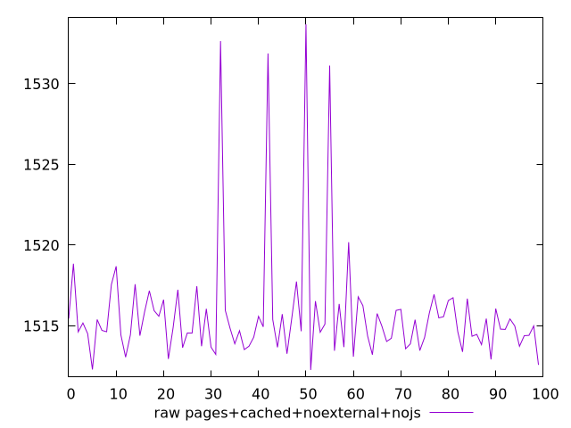
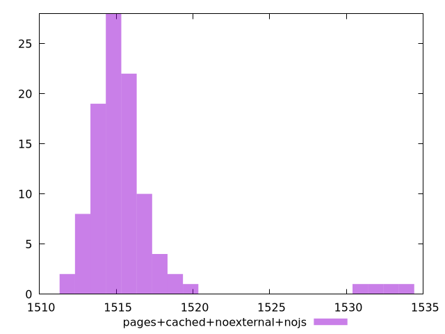

# Report pages+cached+noexternal+nojs

[parent..](./..)  


## Scores

  

## Score Histogram

  

## Score Indicators

```yaml
min: 0.9888178938524337
max: 0.9897650984457727
range: 0.0009472045933389683
mean: 0.9896154297413753
median: 0.9896534225941546
stdev: 0.00016283537179756006
skewness: -3.686281282659096

```

## Raw Values

  

## Raw Values Histogram

  

## Raw Indicators

```yaml
min: 1512.2695999999999
max: 1533.681
range: 21.411400000000185
mean: 1515.7238659999994
median: 1514.8656
stdev: 3.6865714581225815
skewness: 3.6442227930522377

```

<style>
  img {
    max-width: 80%;
  }
</style>
      
