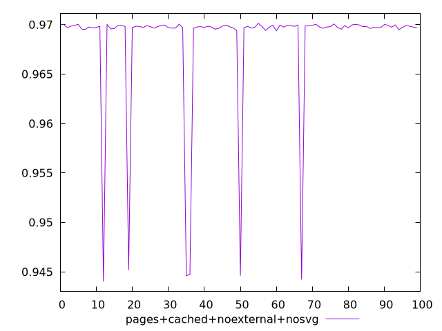
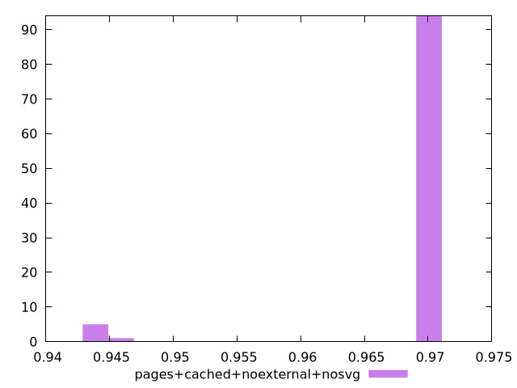
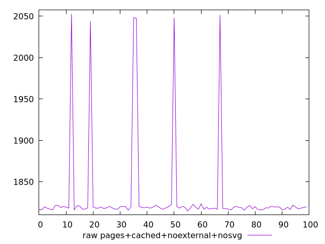
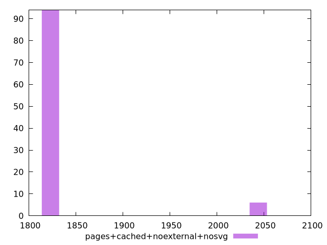

# Report pages+cached+noexternal+nosvg

[parent..](./..)  


## Scores

  

## Score Histogram

  

## Score Indicators

```yaml
min: 0.944014244639886
max: 0.9701394823331744
range: 0.02612523769328834
mean: 0.9682820371415203
median: 0.9697751655151644
stdev: 0.005996858501763682
skewness: -3.702771014923298

```

## Raw Values

  

## Raw Values Histogram

  

## Raw Indicators

```yaml
min: 1814.9948000000002
max: 2052.8760500000003
range: 237.88125000000014
mean: 1832.6259929999997
median: 1819.07315
stdev: 54.62628207524794
skewness: 3.700295103089751

```

<style>
  img {
    max-width: 80%;
  }
</style>
      
