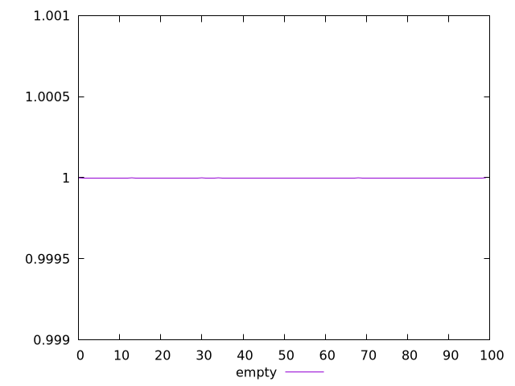
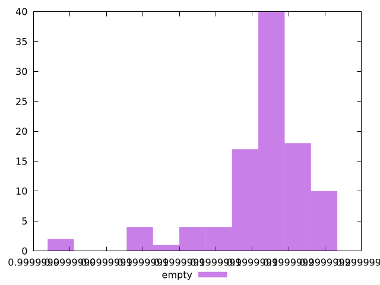
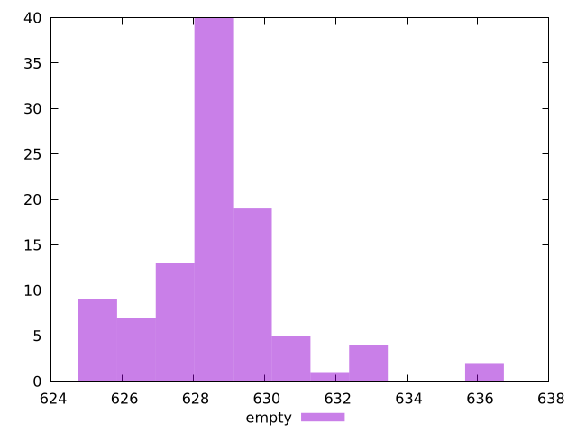

# Report empty

[parent..](./..)  


## Scores

  

## Score Histogram

  

## Score Indicators

```yaml
min: 0.9999990303204299
max: 0.9999991860275903
range: 1.55707160387486e-7
mean: 0.9999991428036235
median: 0.9999991466423142
stdev: 2.7696935540474534e-8
skewness: -1.505214384518351

```

## Raw Values

  

## Raw Values Histogram

  

## Raw Indicators

```yaml
min: 625.16225
max: 636.54885
range: 11.386600000000044
mean: 628.470438
median: 628.2082499999999
stdev: 2.0518513899052238
skewness: 1.3653662993665308

```

<style>
  img {
    max-width: 80%;
  }
</style>
      
