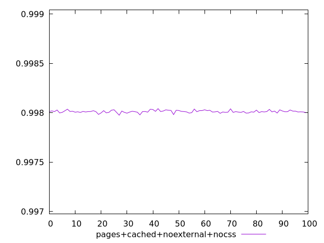
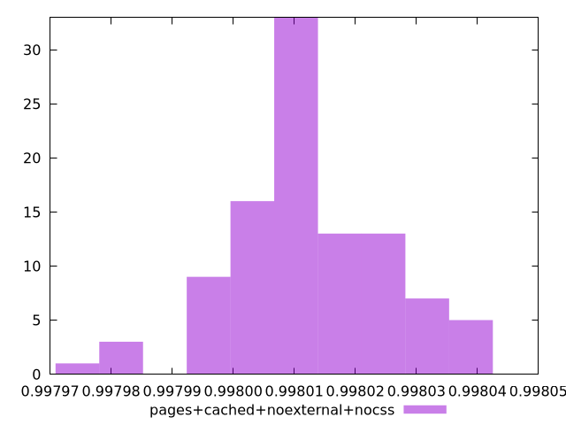
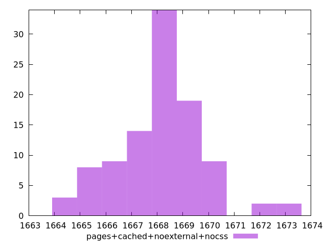

# Report pages+cached+noexternal+nocss

[parent..](./..)  


## Scores

  

## Score Histogram

  

## Score Indicators

```yaml
min: 0.9979754686569919
max: 0.998041920861012
range: 0.00006645220402001772
mean: 0.9980124996744051
median: 0.9980117681413254
stdev: 0.000012488765376675895
skewness: -0.15352813086996162

```

## Raw Values

  

## Raw Values Histogram

  

## Raw Indicators

```yaml
min: 1664.1504999999997
max: 1673.1508
range: 9.000300000000152
mean: 1668.1590290000004
median: 1668.2622000000001
stdev: 1.6932487651431924
skewness: 0.1351789044922684

```

<style>
  img {
    max-width: 80%;
  }
</style>
      
