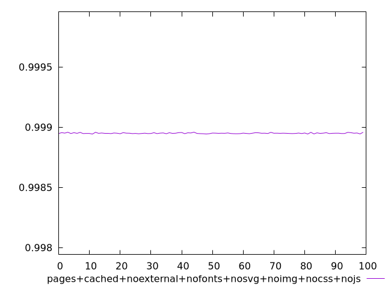
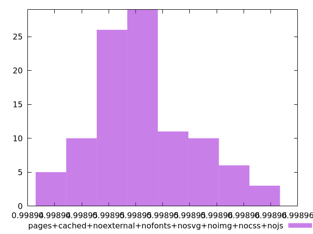
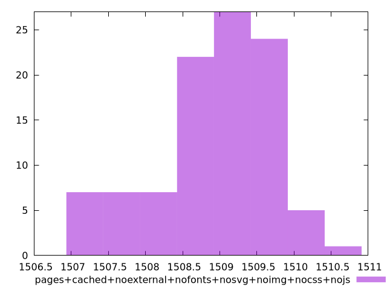

# Report pages+cached+noexternal+nofonts+nosvg+noimg+nocss+nojs

[parent..](./..)  


## Scores

  

## Score Histogram

  

## Score Indicators

```yaml
min: 0.9989435797760928
max: 0.9989593562789347
range: 0.00001577650284190213
mean: 0.9989505171674056
median: 0.9989500761334531
stdev: 0.0000035808676571734543
skewness: 0.5574580456759715

```

## Raw Values

  

## Raw Values Histogram

  

## Raw Indicators

```yaml
min: 1506.9898
max: 1510.459
range: 3.4692000000000007
mean: 1508.9373759999999
median: 1509.0353
stdev: 0.7874440329471022
skewness: -0.5632224666911744

```

<style>
  img {
    max-width: 80%;
  }
</style>
      
