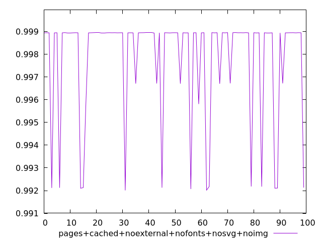
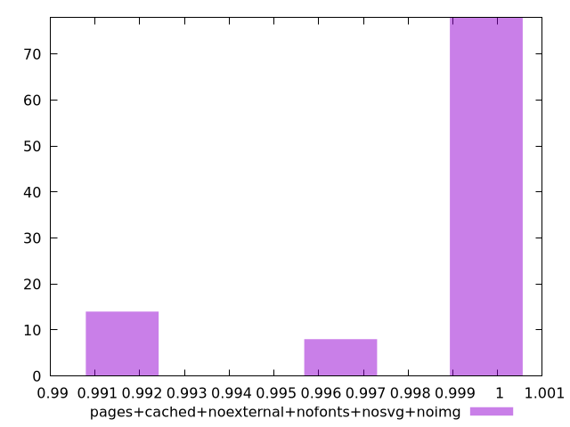
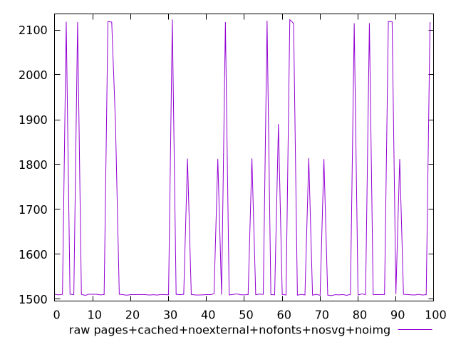
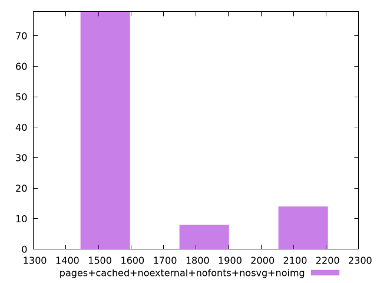

# Report pages+cached+noexternal+nofonts+nosvg+noimg

[parent..](./..)  


## Scores

  

## Score Histogram

  

## Score Indicators

```yaml
min: 0.9920095198111976
max: 0.9989547655932997
range: 0.006945245782102094
mean: 0.9977915530991004
median: 0.9989435767893728
stdev: 0.002387834095364402
skewness: -1.8128515015630728

```

## Raw Values

  

## Raw Values Histogram

  

## Raw Indicators

```yaml
min: 1508.0034
max: 2123.4029499999997
range: 615.3995499999996
mean: 1621.093204
median: 1510.4596500000002
stdev: 218.78200753317773
skewness: 1.619172145674017

```

<style>
  img {
    max-width: 80%;
  }
</style>
      
