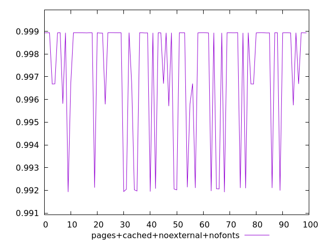
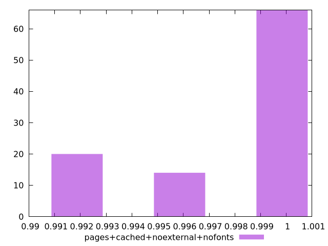
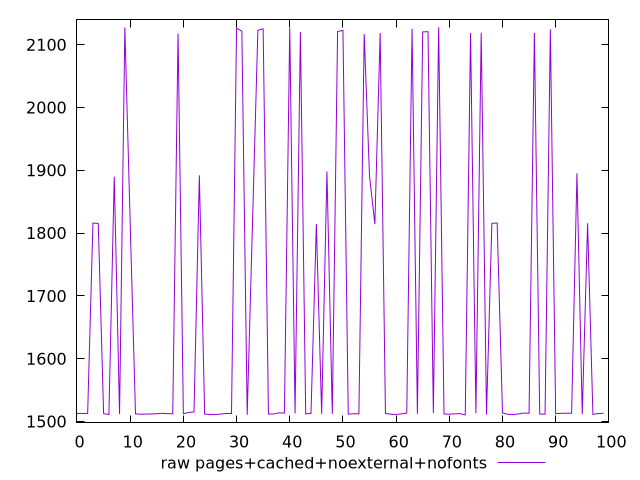
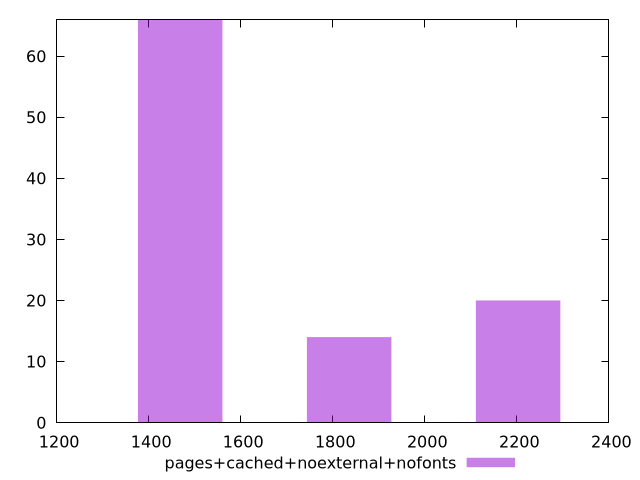

# Report pages+cached+noexternal+nofonts

[parent..](./..)  


## Scores

  

## Score Histogram

  

## Score Indicators

```yaml
min: 0.9919193843592118
max: 0.9989437188118528
range: 0.007024334452641057
mean: 0.9971945307791029
median: 0.9989329854336153
stdev: 0.0027300914907779764
skewness: -1.1885101260008293

```

## Raw Values

  

## Raw Values Histogram

  

## Raw Indicators

```yaml
min: 1510.4286000000002
max: 2127.8655
range: 617.4368999999997
mean: 1680.5527344999991
median: 1512.7665
stdev: 248.21882781082724
skewness: 0.9668443775703501

```

<style>
  img {
    max-width: 80%;
  }
</style>
      
