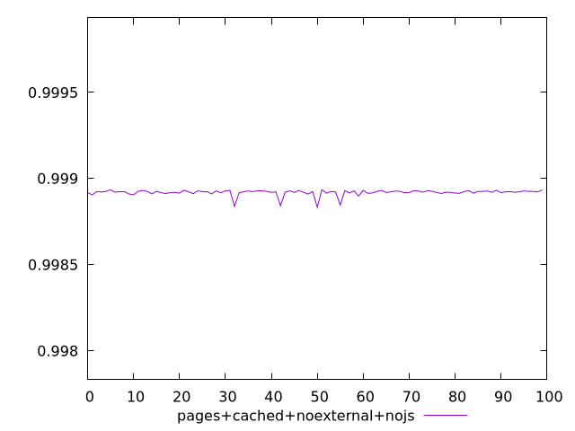
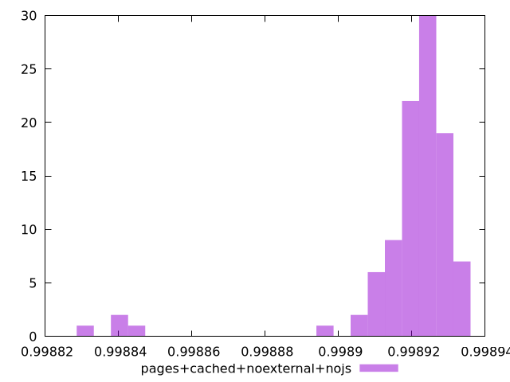
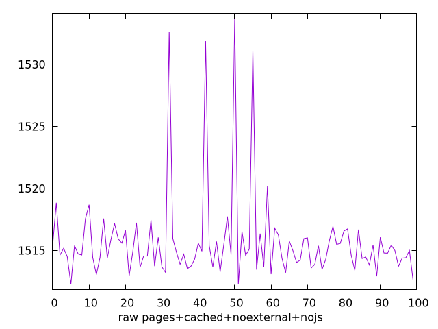
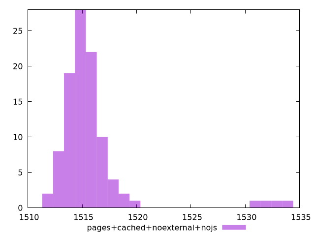

# Report pages+cached+noexternal+nojs

[parent..](./..)  


## Scores

  

## Score Histogram

  

## Score Indicators

```yaml
min: 0.9988332195298826
max: 0.9989352736633577
range: 0.00010205413347508241
mean: 0.9989191839650604
median: 0.9989232775953049
stdev: 0.000017541303010791138
skewness: -3.690742602630364

```

## Raw Values

  

## Raw Values Histogram

  

## Raw Indicators

```yaml
min: 1512.2695999999999
max: 1533.681
range: 21.411400000000185
mean: 1515.7238659999994
median: 1514.8656
stdev: 3.6865714581225815
skewness: 3.6442227930522377

```

<style>
  img {
    max-width: 80%;
  }
</style>
      
