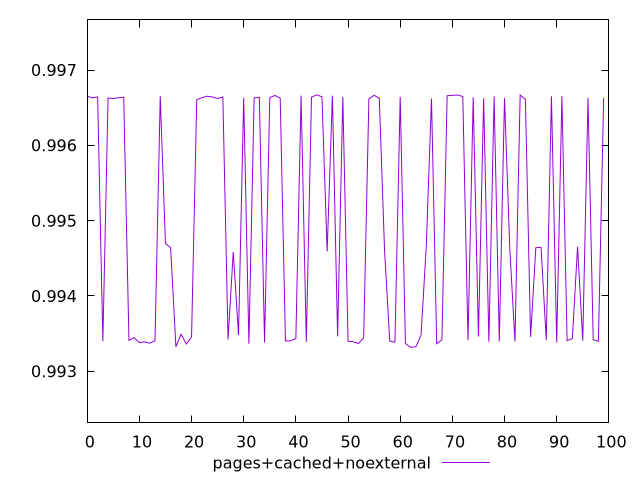
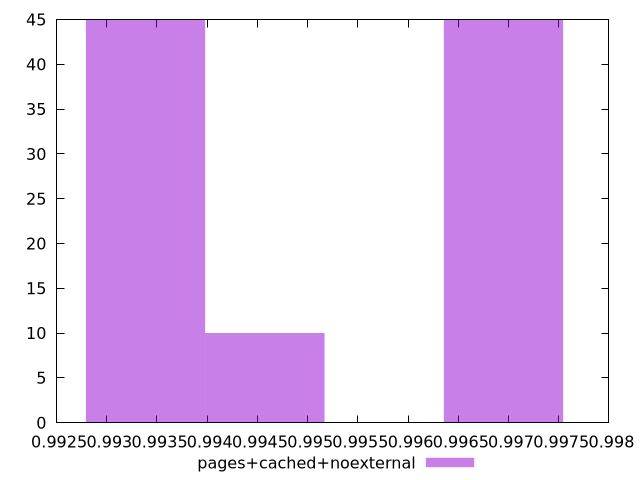
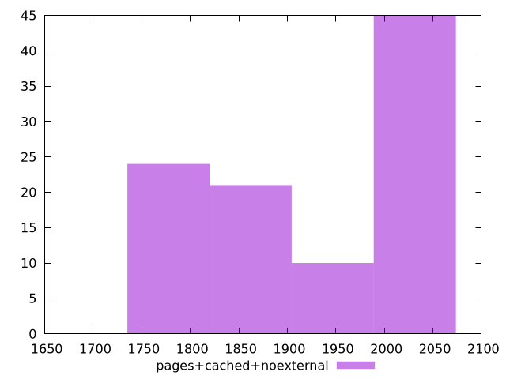

# Report pages+cached+noexternal

[parent..](./..)  


## Scores

  

## Score Histogram

  

## Score Indicators

```yaml
min: 0.9933164666291344
max: 0.9966719546463649
range: 0.0033554880172305124
mean: 0.9949840403903076
median: 0.9946418065652021
stdev: 0.001540300083599472
skewness: 0.07311632774515686

```

## Raw Values

  

## Raw Values Histogram

  

## Raw Indicators

```yaml
min: 1816.8288000000002
max: 2054.36825
range: 237.53944999999976
mean: 1938.5034780000008
median: 1973.8833
stdev: 109.65505452247588
skewness: -0.10375359337351027

```

<style>
  img {
    max-width: 80%;
  }
</style>
      
