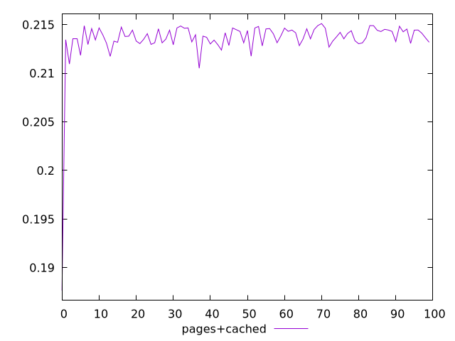
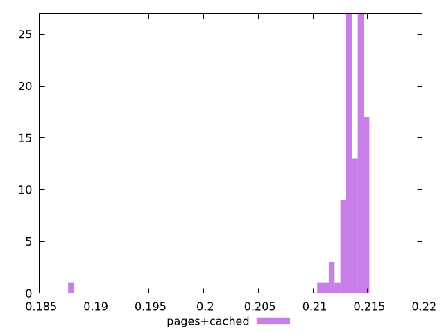
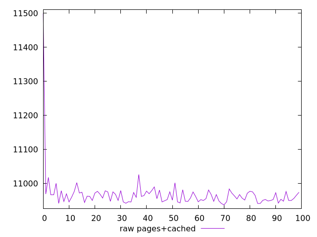
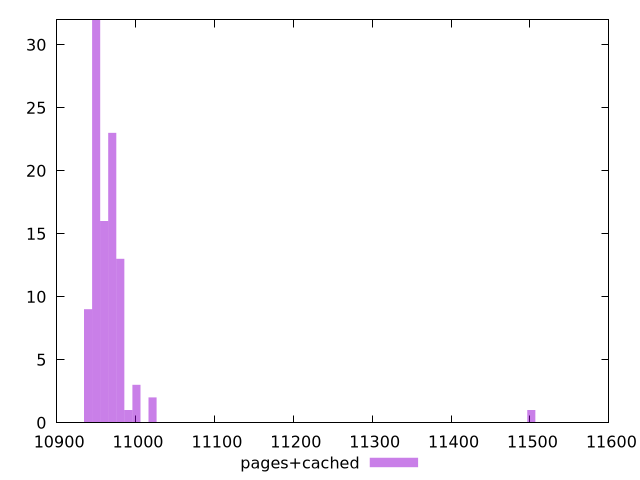

# Report pages+cached

[parent..](./..)  


## Scores

  

## Score Histogram

  

## Score Indicators

```yaml
min: 0.18764897137840159
max: 0.21511107483562297
range: 0.027462103457221387
mean: 0.21352123846756627
median: 0.21382538063262083
stdev: 0.0027416514998369135
skewness: -8.408142391106598

```

## Raw Values

  

## Raw Values Histogram

  

## Raw Indicators

```yaml
min: 10937.099700000002
max: 11499.187000000002
range: 562.0872999999992
mean: 10968.052577000006
median: 10961.828700000002
stdev: 55.9630430957591
skewness: 8.551460480629014

```

<style>
  img {
    max-width: 80%;
  }
</style>
      
