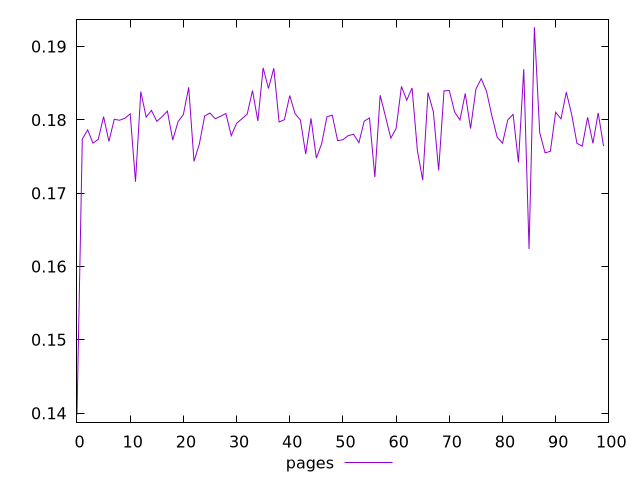
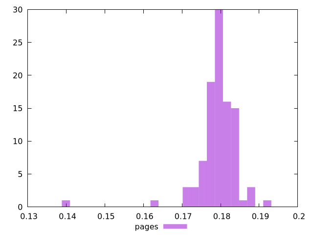
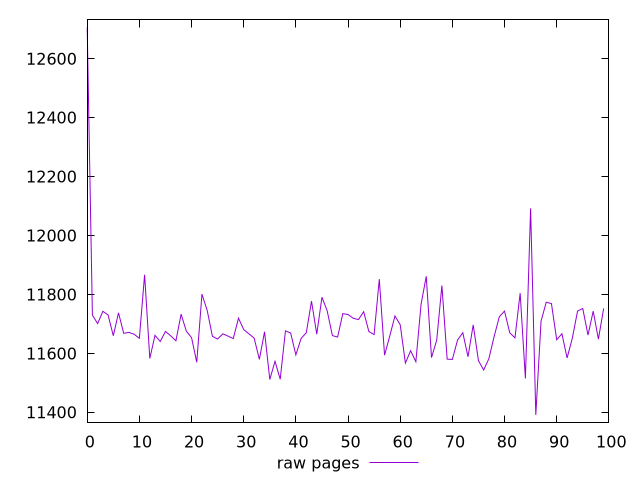
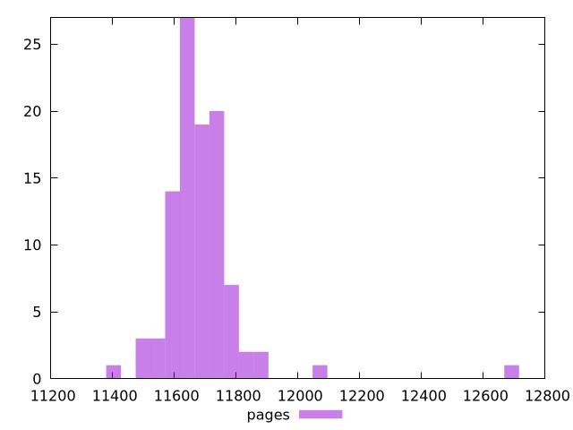

# Report pages

[parent..](./..)  


## Scores

  

## Score Histogram

  

## Score Indicators

```yaml
min: 0.13976444748412886
max: 0.1926374973693175
range: 0.05287304988518865
mean: 0.17933088471238662
median: 0.18014987730945928
stdev: 0.005546460417827762
skewness: -3.721242884378738

```

## Raw Values

  

## Raw Values Histogram

  

## Raw Indicators

```yaml
min: 11391.3985
max: 12706.438999999998
range: 1315.0404999999992
mean: 11687.4035
median: 11666.5995
stdev: 135.63776664229627
skewness: 4.355688403004219

```

<style>
  img {
    max-width: 80%;
  }
</style>
      
