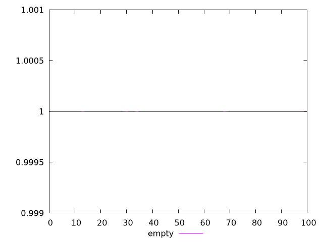

# Report empty

[parent..](./..)  


## Scores

  

## Score Histogram

  

## Score Indicators

```yaml
min: 0.9999997296920115
max: 0.9999997909334013
range: 6.124138984819893e-8
mean: 0.9999997743465073
median: 0.9999997759063688
stdev: 1.0818872458579334e-8
skewness: -1.5805074585057357

```

## Raw Values

  

## Raw Values Histogram

  

## Raw Indicators

```yaml
min: 625.16225
max: 636.54885
range: 11.386600000000044
mean: 628.470438
median: 628.2082499999999
stdev: 2.0518513899052238
skewness: 1.3653662993665308

```

<style>
  img {
    max-width: 80%;
  }
</style>
      
