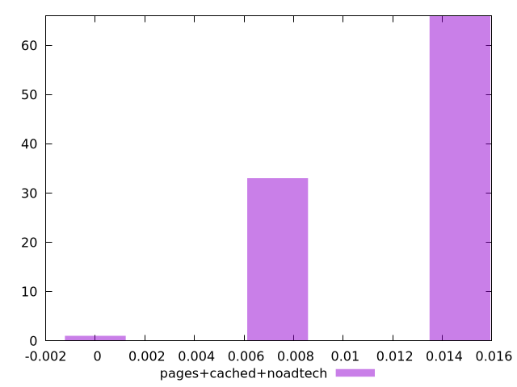

# Report pages+cached+noadtech

[parent..](./..)  


## Scores

  

## Score Histogram

  

## Score Indicators

```yaml
min: 8.945789222170042e-7
max: 0.014510134842865341
range: 0.014509240263943124
mean: 0.011864531070006026
median: 0.014175111213351549
stdev: 0.0033993850602208765
skewness: -0.9150040311668804

```

## Raw Values

  

## Raw Values Histogram

  

## Raw Indicators

```yaml
min: 8908.24545
max: 23055.954400000006
range: 14147.708950000006
mean: 9348.899967000003
median: 8938.335750000002
stdev: 1432.309277708427
skewness: 8.756374678535721

```

<style>
  img {
    max-width: 80%;
  }
</style>
      
