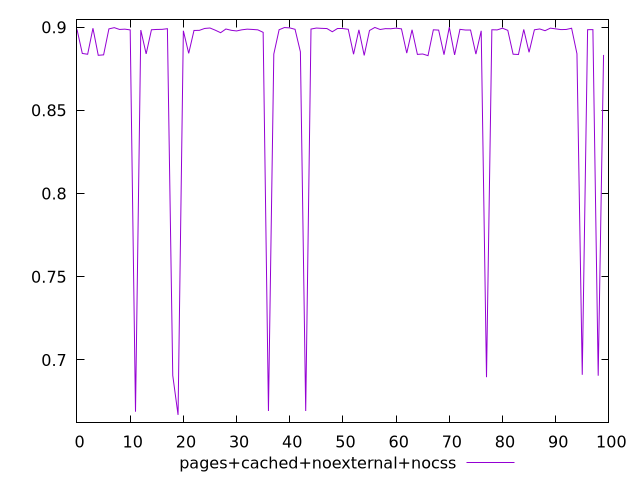
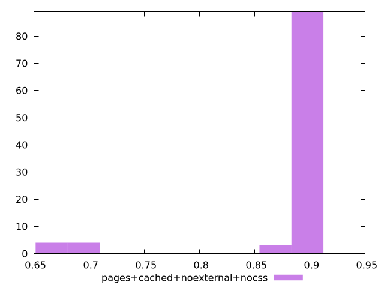
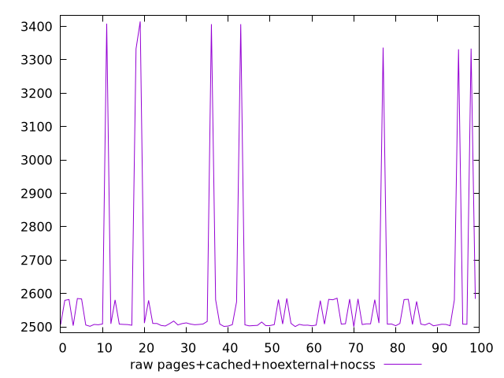
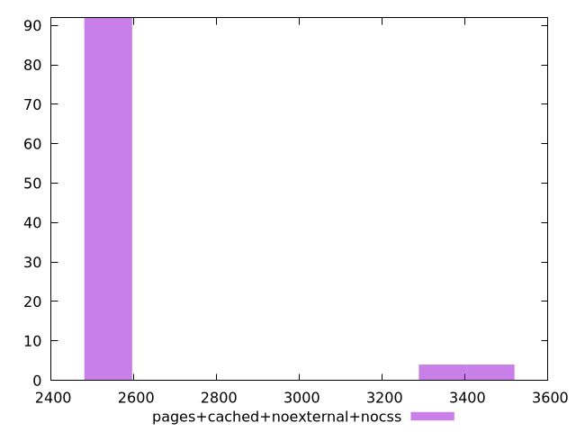

# Report pages+cached+noexternal+nocss

[parent..](./..)  


## Scores

  

## Score Histogram

  

## Score Indicators

```yaml
min: 0.6669467082670449
max: 0.899930034354399
range: 0.23298332608735406
mean: 0.8778407856553275
median: 0.8983688646518135
stdev: 0.05888159760529556
skewness: -3.053472522735201

```

## Raw Values

  

## Raw Values Histogram

  

## Raw Indicators

```yaml
min: 2500.3651
max: 3414.5454999999997
range: 914.1803999999997
mean: 2592.5681999999993
median: 2508.4854
stdev: 231.8593222984106
skewness: 3.014913744279808

```

<style>
  img {
    max-width: 80%;
  }
</style>
      
