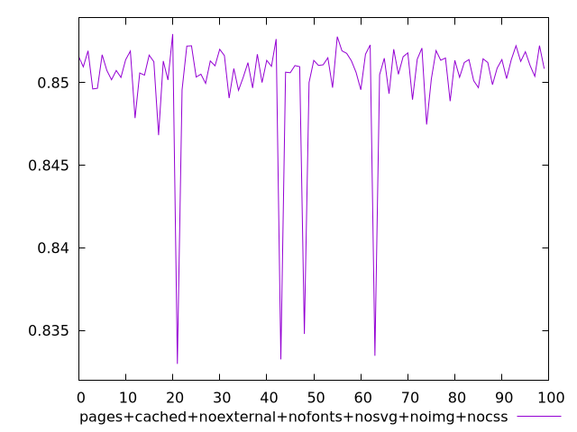
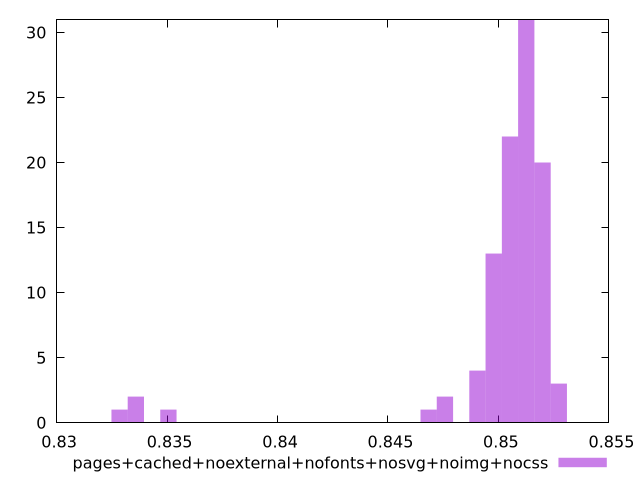
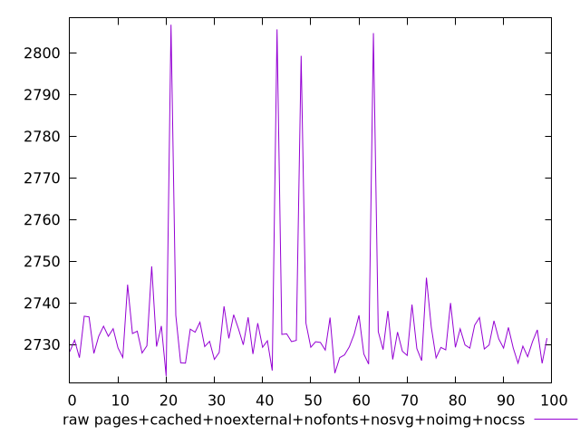
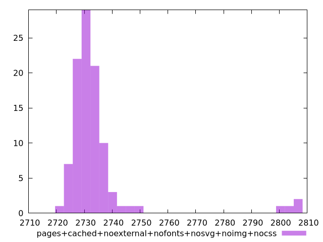

# Report pages+cached+noexternal+nofonts+nosvg+noimg+nocss

[parent..](./..)  


## Scores

  

## Score Histogram

  

## Score Indicators

```yaml
min: 0.8329705764374848
max: 0.8529436760047278
range: 0.019973099567242913
mean: 0.850179499802682
median: 0.8510289667044806
stdev: 0.0035460507229281425
skewness: -4.0685948809964465

```

## Raw Values

  

## Raw Values Histogram

  

## Raw Indicators

```yaml
min: 2722.4326
max: 2806.754100000001
range: 84.32150000000092
mean: 2734.3057440000002
median: 2730.717850000001
stdev: 14.970002492114599
skewness: 4.043207879951638

```

<style>
  img {
    max-width: 80%;
  }
</style>
      
