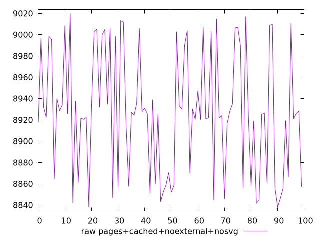
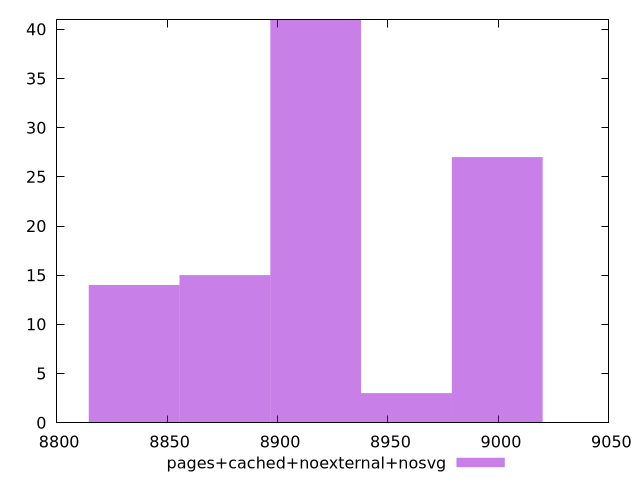

# Report pages+cached+noexternal+nosvg

[parent..](./..)  


## Scores

  

## Score Histogram

  

## Score Indicators

```yaml
min: 0.01330480788092775
max: 0.015323794615359376
range: 0.002018986734431627
mean: 0.014316352241951042
median: 0.01431491604988297
stdev: 0.0006343815749748023
skewness: -0.01874461046844942

```

## Raw Values

  

## Raw Values Histogram

  

## Raw Indicators

```yaml
min: 8837.979899999998
max: 9019.975449999998
range: 181.99554999999964
mean: 8926.838573500005
median: 8925.693075
stdev: 57.18597331840502
skewness: 0.07532279987259327

```

<style>
  img {
    max-width: 80%;
  }
</style>
      
