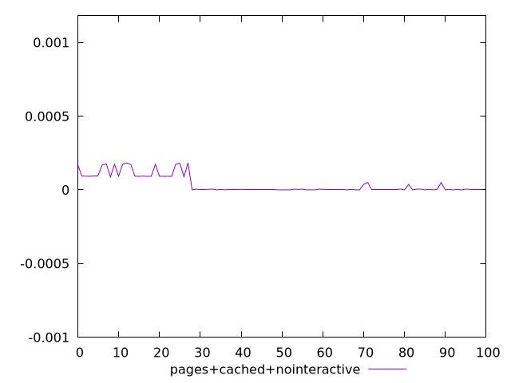
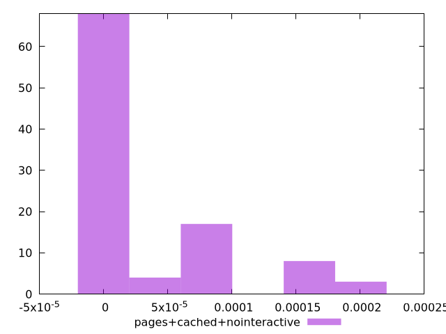
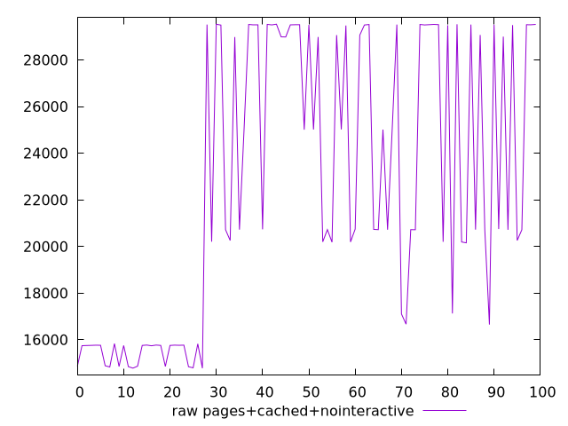
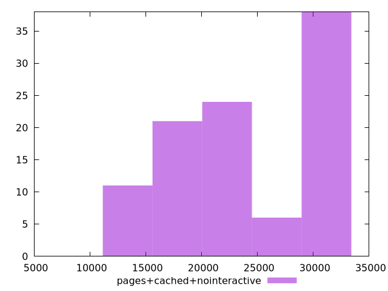

# Report pages+cached+nointeractive

[parent..](./..)  


## Scores

  

## Score Histogram

  

## Score Indicators

```yaml
min: 2.5091771993501766e-8
max: 0.0001829297357594517
range: 0.0001829046439874582
mean: 0.000037722881580868896
median: 0.0000036443401628394323
stdev: 0.00005910349492563633
skewness: 1.3764713246104774

```

## Raw Values

  

## Raw Values Histogram

  

## Raw Indicators

```yaml
min: 14779.420749999997
max: 29531.422649999986
range: 14752.001899999988
mean: 22590.464042999996
median: 20723.100250000003
stdev: 5905.695732828722
skewness: 0.03182107979061257

```

<style>
  img {
    max-width: 80%;
  }
</style>
      
