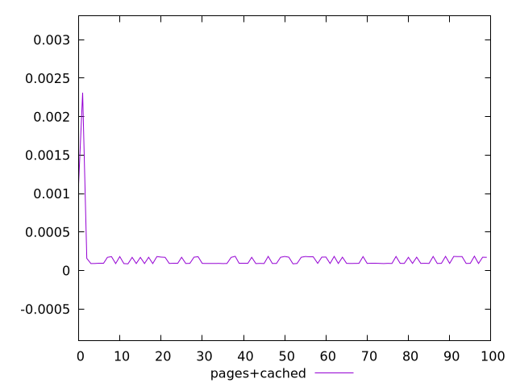
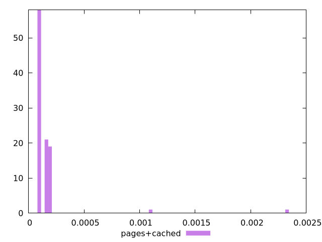
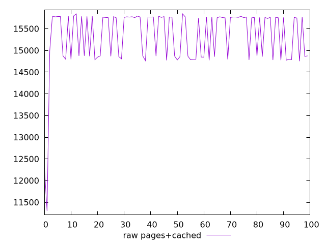
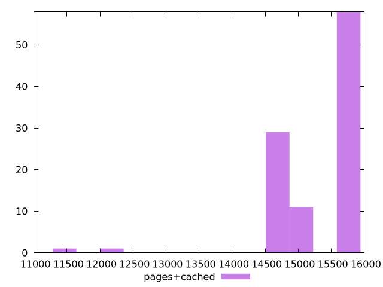

# Report pages+cached

[parent..](./..)  


## Scores

  

## Score Histogram

  

## Score Indicators

```yaml
min: 0.0000872974611407229
max: 0.002311003265440925
range: 0.0022237058043002023
mean: 0.00015795546786682936
median: 0.00009282685657271972
stdev: 0.00024060036887259953
skewness: 7.750157974171332

```

## Raw Values

  

## Raw Values Histogram

  

## Raw Indicators

```yaml
min: 11302.4264
max: 15844.007299999994
range: 4541.580899999994
mean: 15315.764987000004
median: 15754.665900000004
stdev: 684.4600519819282
skewness: -2.847637967015656

```

<style>
  img {
    max-width: 80%;
  }
</style>
      
