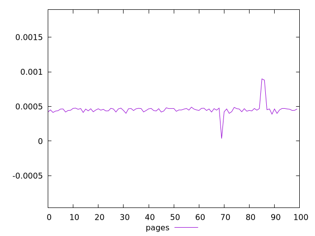
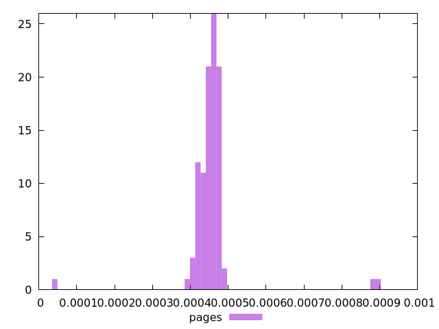
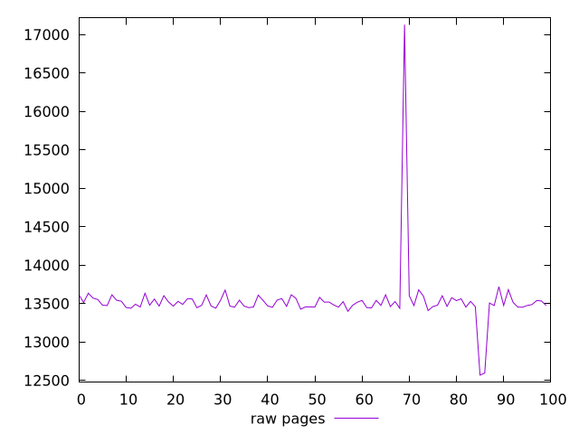
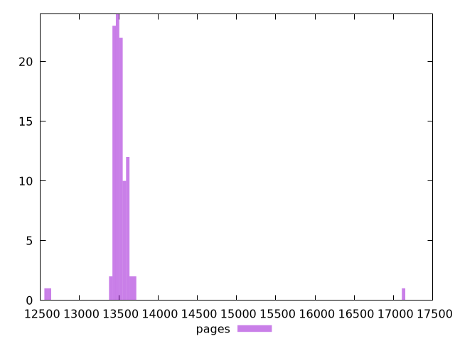

# Report pages

[parent..](./..)  


## Scores

  

## Score Histogram

  

## Score Indicators

```yaml
min: 0.000036598970945544984
max: 0.0008981697720857329
range: 0.0008615708011401879
mean: 0.0004554698388282058
median: 0.0004584683027187286
stdev: 0.00007733380554474342
skewness: 1.912231202499617

```

## Raw Values

  

## Raw Values Histogram

  

## Raw Indicators

```yaml
min: 12569.567
max: 17128.032
range: 4558.465
mean: 13533.180519999994
median: 13490.867499999998
stdev: 389.7681279484953
skewness: 7.5561127170291

```

<style>
  img {
    max-width: 80%;
  }
</style>
      
