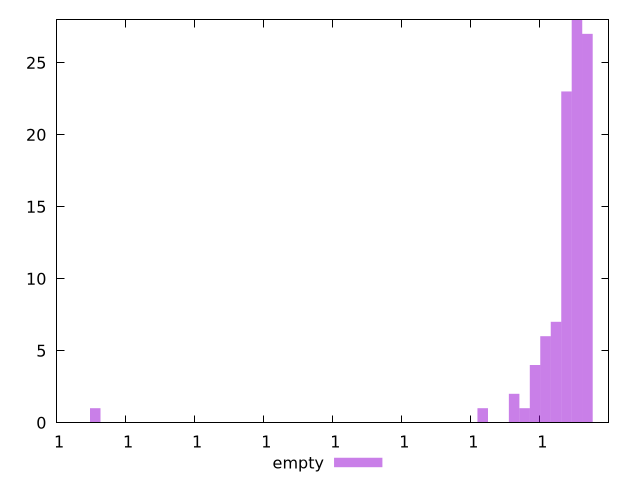

# Report empty

[parent..](./..)  


## Scores

  

## Score Histogram

  

## Score Indicators

```yaml
min: 0.9999999999963033
max: 0.9999999999998737
range: 3.570366224892041e-12
mean: 0.9999999999996778
median: 0.9999999999997451
stdev: 3.643075598259554e-13
skewness: -8.00318827209663

```

## Raw Values

  

## Raw Values Histogram

  

## Raw Indicators

```yaml
min: 80.164
max: 102.92399999999999
range: 22.75999999999999
mean: 84.79039999999998
median: 84.332
stdev: 3.043510394265149
skewness: 2.4066787002589907

```

<style>
  img {
    max-width: 80%;
  }
</style>
      
